# Audit Engagement Monitoring System (AEMS) Workflow Design

> **Module reference:** Governance, phase status, route inventory, and
> acceptance controls for all AEMS-G phases are compiled in
> [AEMS Governance and Acceptance](AEMS_GOVERNANCE_AND_ACCEPTANCE.md). This
> workflow document remains the detailed operational sequence reference.

## 1. Document purpose and status

This document defines the controlled workflows and records the implemented
foundation for the Audit Engagement Monitoring System.
AEMS performs the audit work authorized by an approved Internal Annual Audit
Plan or by an approved special-engagement authority.

The intended operational chain is:

```mermaid
flowchart LR
    IAP[Approved IAP engagement] --> ENG[Engagement Registry]
    SA[Approved special authority] --> ENG
    ENG --> AEO[Audit Engagement Order]
    AEO --> AEP[Audit Engagement Plan]
    AEP --> AP[Audit Program]
    AP --> FW[Fieldwork]
    FW --> WP[Working Papers and Evidence]
    WP --> ISS[Issues and Findings]
    ISS --> MR[Management Response and Rejoinder]
    MR --> EC[Exit Conference]
    EC --> AR[Audit Report]
    AR --> CMS[Final recommendations to CMS]
    CMS --> CLOSE[Engagement Closure]
```

Design status: **operational through the complete child-record workflow and
engagement closure boundary**. Engagement Registry, Audit Team, AEO, AEP, Audit
Program, Working Papers, Audit Evidence, Issues, Findings, Recommendations,
Auditee Responses, Entry/Exit Conferences, Audit Reports, Completion Assessment,
formal Closure, retention/final-index metadata, dashboard progress, and
controlled reopening are implemented with scoped APIs, protected React pages,
immutable versions, audit/activity records, notifications, and tests. The
reference-alignment gaps and target navigation contract are recorded in the
[AEMS Implementation Baseline](AEMS_IMPLEMENTATION_BASELINE.md). The resolved
professional decisions and the rule-to-code-to-test conformance index are in
the [AEMS Governance and Acceptance](AEMS_GOVERNANCE_AND_ACCEPTANCE.md);
the operational subset must not be read as full MDS/UID conformance.

The aggregate engagement transition service and the formal engagement closure
workflow are implemented in the current as-built system. CMS transfer is
idempotent. AIS-5D provides a separate read-only analytical and integration
health surface; it does not add AEMS-owned professional writes. ARMIS is the
sole operational resource provider. AEMS-3A adds versioned team safeguards,
current ARMIS provider checks, specialist and authorized-participant roles, and
strict gates for missing or stale ARMIS data. IAP resource values are retained
only as historical planning lineage and are not an active fallback.

The sidebar exposes AEMS as a collapsible module, consistent with IAP:

- `/audit-engagement-management/dashboard` — live AEMS module dashboard;
- `/audit-engagement-management` — Engagement Registry;
- `/audit-engagement-management/team` — Audit Team assignments and warnings;
- `/audit-engagement-management/aeo` — versioned AEO workflow and PDF;
- `/audit-engagement-management/aep` — immutable Audit Engagement Plan;
- `/audit-engagement-management/audit-program` — fieldwork procedure baseline;
- `/audit-engagement-management/working-papers` — Working Papers and Evidence;
- `/audit-engagement-management/issues` — issue capture, review, di smissal, and conversion;
- `/audit-engagement-management/findings` — Findings and Recommendations;
- `/audit-engagement-management/auditee-responses` — management responses and auditor dialogue;
- `/audit-engagement-management/exit-conferences` — schedule, attendance, finding discussions, minutes, files, and acknowledgement;
- `/audit-engagement-management/{engagement}` — complete engagement details.

Current display labels use **Audit Engagement Workspace**, **Planning
Workspace**, **Audit Procedure Details**, and **Conference Management**. The
canonical scope transaction is `/audit-engagement-management/scope`, and the
canonical procedure-detail route is
`/audit-engagement-management/audit-procedure-details`; Entry and Exit
Conference routes remain compatibility children below Conference Management.

Legacy placeholder navigation used module code `AEM`. Functional engagement
features use the granular `aems.*` permission namespace and `AEMS`
activity/audit metadata. Legacy `aem.view` remains compatibility-only and must
not authorize a functional AEMS action.

## 2. Workflow design principles

All AEMS workflows follow these rules:

1. Workflow statuses and transition actions are controlled application values,
   not editable Master List items.
2. The backend is authoritative. Hiding a frontend action is not authorization.
3. Every transition validates the current state, actor, permission, engagement
   assignment, office scope, prerequisites, and optimistic lock version.
4. Every transition records actor, date, action, comment, old values, new
   values, request metadata, and the affected record version.
5. Return, rejection, suspension, cancellation, dismissal, override, revision,
   and closure actions require a comment.
6. A preparer cannot approve their own controlled record.
7. An issued, approved, finalized, or closed version is immutable.
8. Corrections to immutable records create a new formal version or revision.
9. Ordinary removal uses soft deletion. Archive state is independent from
   workflow state.
10. Transactions and row locks protect transitions and version generation.
11. Notifications are created only after the underlying transaction succeeds.
12. Historical source links to Core, IAP, documents, and CMS are preserved.

The Core Workflow Management engine may provide responsible-role assignment,
SLAs, reminders, notifications, and immutable instance events. It must not add
or remove AEMS business states. A module-specific AEMS transition service
remains responsible for all cross-record business guards.

## 3. Actors and approval boundaries

| Actor                  | Typical workflow responsibility                                                              |
| ---------------------- | -------------------------------------------------------------------------------------------- |
| CIAS Management        | Authorize engagements, approve/issue controlled documents, finalize reports, approve closure |
| Engagement Supervisor  | Supervise scope, team, quality, findings, and reporting                                      |
| Team Leader            | Prepare engagement records, coordinate fieldwork, review team output                         |
| Reviewer               | Independently review AEO, AEP, programs, working papers, findings, and reports               |
| Assigned Auditor       | Perform procedures, prepare working papers, upload evidence, draft issues                    |
| Auditee Representative | View formally communicated matters, submit management responses, acknowledge conferences     |
| AGIS Administrator     | Maintain configuration and monitor activity; no automatic audit approval authority           |
| Platform Administrator | Technical administration; no automatic audit approval authority                              |
| Read-Only User         | View only specifically authorized final or issued records                                    |

Supervisor, Team Leader, Reviewer, and Auditor are engagement assignments. They
do not require separate platform roles if the user has the required `AGIS User`
or `CIAS Management` role and the corresponding permission.

The same user must not occupy incompatible responsibilities for the same
approval:

- AEO/AEP/report preparer and approver;
- working-paper preparer and final reviewer;
- finding author and final validator;
- management-response author and auditor disposition author.

## 4. Engagement aggregate lifecycle

The engagement aggregate represents the complete audit and summarizes the
progress of its controlled child workflows.

### 4.1 Controlled states

| Code                        | Meaning                                                                      |
| --------------------------- | ---------------------------------------------------------------------------- |
| `DRAFT`                     | Engagement identity and source are being prepared                            |
| `AUTHORIZATION_PREPARATION` | Team and AEO are being prepared                                              |
| `RETURNED_FOR_REVISION`     | The current stage was returned; return context identifies the resume state   |
| `AUTHORIZED`                | AEO is approved and issued                                                   |
| `ENGAGEMENT_PLANNING`       | AEP and Audit Program are being prepared                                     |
| `FIELDWORK`                 | Approved procedures are being performed                                      |
| `FINDINGS_COMMUNICATION`    | Issues, findings, responses, rejoinders, and exit-conference work are active |
| `REPORTING`                 | Draft and final reports are being prepared and reviewed                      |
| `ISSUED`                    | The final report has been issued                                             |
| `CLOSURE_REVIEW`            | Closure requirements are being checked and approved                          |
| `COMPLETED`                 | Substantive audit work and completion gates are complete; formal closure remains open |
| `CLOSED`                    | Engagement is complete and locked                                            |
| `SUSPENDED`                 | Work is temporarily stopped; the prior state is retained                     |
| `CANCELLED`                 | Work ended by authorized cancellation before report issuance                 |

`ARCHIVED` is not an engagement workflow state. Archiving sets `deleted_at` and
retains the current workflow status. Restoring an archived record does not
resume, reopen, or change its workflow.

The SCR-212 Define Engagement Scope workspace is a dedicated transaction at
`/audit-engagement-management/scope?engagementId={engagementId}`. It enforces
one Engagement Office, filters Audit Areas by the selected office, filters Audit
Focuses by the selected Area, and records structured boundaries, limitations,
and approved source-variance decisions. Imported IAP risk lineage exposes
whether the source is from `iap_universe_risk_assessments` or the legacy
`iap_risk_assessments` system; neither source table is mutated.

New engagements begin as `DRAFT` without scope details. The Lifecycle workspace
must first move the engagement to `AUTHORIZATION_PREPARATION`; Audit Team
assignment is locked in `DRAFT` and unlocks only in that phase. AEO, planning,
and later workspaces remain phase-gated, and the engagement detail shows the
Lifecycle workspace while operational details are locked.

### 4.2 State diagram

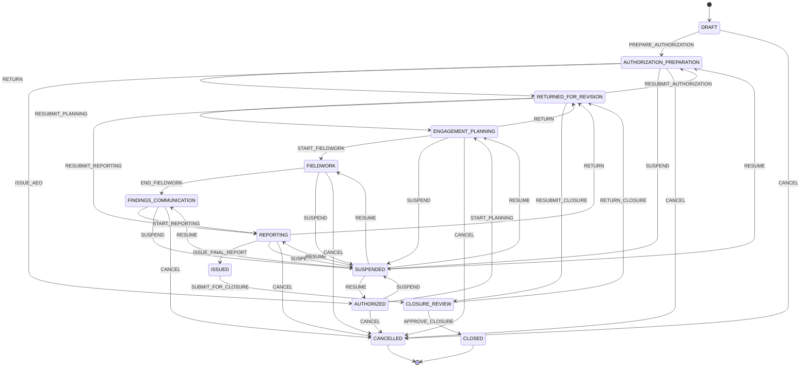

The system stores `returned_from_status`, `return_to_status`, and
`suspended_from_status`. A generic `RESUBMIT` or `RESUME` action may only return
to the recorded valid state; the client cannot choose an arbitrary destination.

### 4.3 Engagement transition guards

| Action                  | Required guard                                                                                                |
| ----------------------- | ------------------------------------------------------------------------------------------------------------- |
| `PREPARE_AUTHORIZATION` | Valid source, one-office scope, at least one audit area, dates, type, and required source metadata; Audit Team assignment is not required before this transition |
| `ISSUE_AEO`             | Current AEO version is approved and issued                                                                    |
| `START_PLANNING`        | Issued AEO exists and engagement is not suspended/cancelled                                                   |
| `START_FIELDWORK`       | Approved AEP and approved Audit Program exist; required team roles are filled                                 |
| `END_FIELDWORK`         | All required procedures are completed or formally waived; working papers are submitted                        |
| `START_REPORTING`       | Issues are dismissed or converted; communicated findings have response disposition or documented non-response |
| `ISSUE_FINAL_REPORT`    | Final report version is approved, required recipients exist, and confidentiality is assigned                  |
| `SUBMIT_FOR_CLOSURE`    | Final report is issued and recommendation transfer requirements are satisfied                                 |
| `APPROVE_CLOSURE`       | Closure checklist is complete and no blocking workflow remains                                                |
| `SUSPEND`               | CIAS authority, reason, effective date, and resume conditions are recorded                                    |
| `RESUME`                | Original state is valid and resume authority and comment are recorded                                         |
| `CANCEL`                | CIAS authority, reason, disposition of work/evidence, and notification recipients are recorded                |

## 5. Engagement source authorization

An engagement has exactly one source type.

### 5.1 Planned engagement

- References an approved or active IAP plan engagement.
- Retains source plan, prioritization, Audit Universe, risk assessment, office,
  audit area, focus, objectives, preliminary scope, dates, and person-days.
- Stores a source snapshot so later planning revisions cannot silently rewrite
  an active audit.
- One IAP engagement may have only one non-cancelled AEMS engagement unless
  CIAS Management approves a successor or follow-up relationship.

### 5.2 Special or unplanned engagement

- Requires directive number, authority, reason, approving authority, date, and
  supporting document.
- Requires an auditee office, audit area, objective, preliminary scope, risk
  rationale, dates, and estimated resources.
- The external authority is recorded at creation, but the AEMS aggregate
  starts in `DRAFT`. The registry creator completes the engagement package,
  then uses the controlled `PREPARE_AUTHORIZATION` and
  `ISSUE_AUTHORIZATION` transitions before planning can begin.
- `AUTHORIZED` is therefore an internal lifecycle state, not an assertion that
  a newly created record is already ready for planning.
- Appears in IAP accomplishment reports as unplanned work without being inserted
  retroactively into an approved IAP version.

## 6. Audit Engagement Order workflow

The Audit Engagement Order (AEO) grants the team authority to conduct the audit.

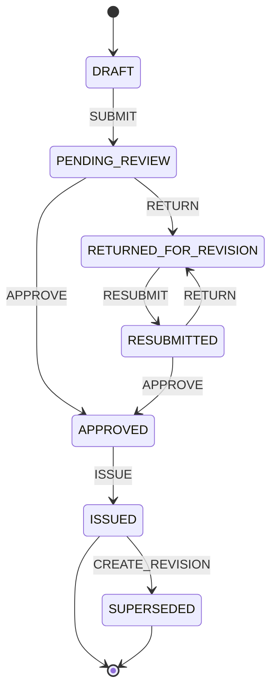

Rules:

- Submission requires engagement authority, auditee, objectives, scope, dates,
  complete team roles, and planned person-days.
- Review may be performed by the assigned Reviewer, Supervisor, or authorized
  CIAS Management user, subject to separation of duties.
- Return requires instructions.
- Approval records the approving authority and approval date.
- Issue generates the official AEO number and locked PDF version.
- An issued AEO cannot be edited, deleted, or overwritten.
- A material change to authority, scope, office, dates, or team creates a new
  version. The previous version becomes `SUPERSEDED` but remains downloadable.
- A minor administrative correction still creates a version and reason.

## 7. Audit Engagement Plan workflow

The Audit Engagement Plan (AEP) defines how the authorized engagement will be
performed.

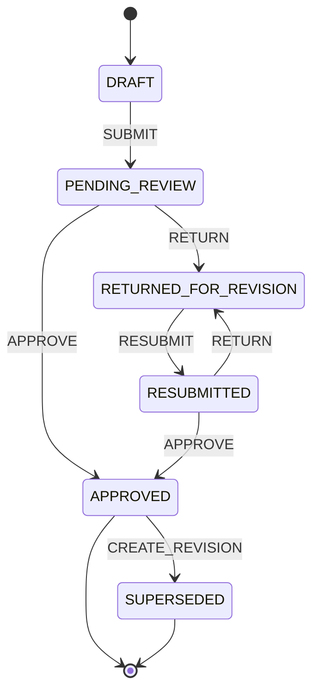

Submission requires:

- an issued AEO;
- objectives and expected outcomes;
- scope and exclusions;
- methodology and audit criteria;
- materiality or sampling approach where applicable;
- schedule and report target date;
- planned person-days and resource requirements;
- identified confidentiality level;
- linked planning risks and required documents.

An approved AEP is immutable. Fieldwork may not begin until the current AEP and
Audit Program are both approved.

## 8. Audit Program workflow

The Audit Program translates the AEP into assigned, reviewable procedures.

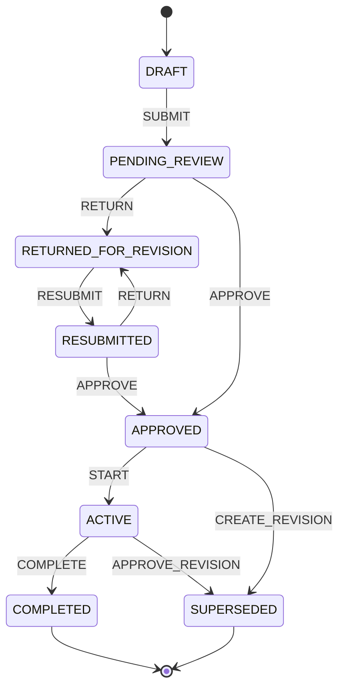

Rules:

- Every procedure has a stable procedure number, objective, description,
  assigned auditor, target date, expected evidence, and working-paper reference.
- Submission requires at least one active procedure and complete assignments.
- Starting fieldwork activates the approved program.
- A procedure may be completed, returned, reassigned, or formally waived.
- Waiver requires Supervisor approval and a reason.
- Program completion requires every procedure to be completed or waived and all
  resulting working papers to have a terminal review disposition.
- Changes to an active approved program create a reviewed revision.

## 9. Working Paper workflow

Working papers document procedures performed, evidence evaluated, results, and
conclusions.

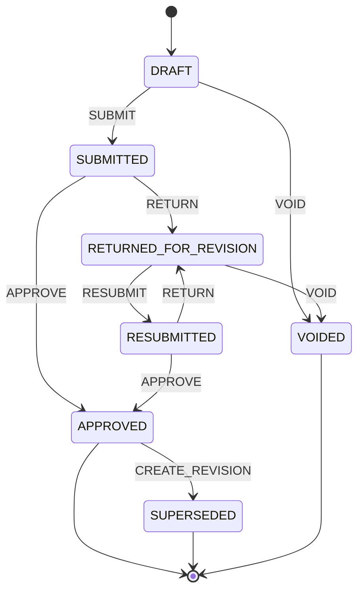

Rules:

- Each working paper has an engagement-unique index and stable family ID.
- Submission requires objective, linked audit procedure, work performed,
  population/sample information when applicable, result, conclusion, preparer,
  and evidence or an explanation that no attachment is required.
- The preparer cannot approve the working paper.
- Return requires reviewer comments.
- Approval locks the content, cross-references, and attached evidence versions.
- A post-approval correction creates a new working-paper version and preserves
  the prior approved version.
- Void does not delete the record. It requires a reason and reviewer authority.
- Findings may cite only approved working-paper versions when validated.

## 10. Audit Evidence governance

Evidence does not use an approval workflow separate from its working paper, but
it has controlled record states:

| State      | Meaning                                                                       |
| ---------- | ----------------------------------------------------------------------------- |
| `DRAFT`    | Uploaded but not yet relied upon by a submitted working paper                 |
| `VERIFIED` | Checksum, source, custodian, date, category, and confidentiality are complete |
| `LOCKED`   | Referenced by an approved working paper, validated finding, or issued report  |
| `VOIDED`   | Retained but explicitly excluded with a documented reason                     |

Evidence files are immutable. A replacement creates a new version with a new
checksum. Locking a working paper stores the exact evidence version IDs it used.
Archive does not remove evidence referenced by an approved or issued record.

## 11. Audit Issue workflow

An Audit Issue is a potential exception raised during fieldwork.

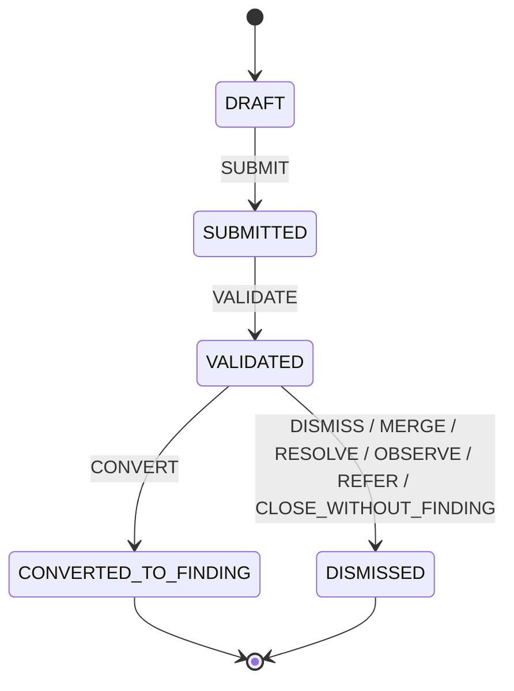

Rules:

- Submission requires an exception statement, responsible office, preliminary
  risk, and at least one linked working paper or evidence record.
- Validation requires the cited working-paper versions to be approved.
- Every terminal disposition requires an independent reviewer and reason;
  merge additionally requires a different active issue in the same engagement,
  and referral requires a destination.
- Conversion creates exactly one finding and stores the issue-to-finding link.
- Conversion is idempotent; retrying cannot create duplicate findings.
- A converted or dismissed issue is immutable.

## 12. Audit Finding workflow

A finding formalizes validated criteria, condition, cause, effect, conclusion,
significance/effect classification, risk, direct fieldwork support, and
recommendations.

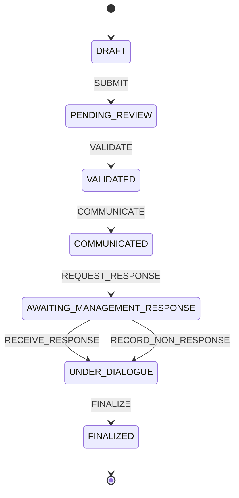

Rules:

- Submission requires criteria, condition, cause, effect, risk rating,
  responsible office, approved working-paper support, verified evidence, and at
  least one draft recommendation or a documented reason for none.
- Validation is performed independently from authorship.
- Communication records recipients, date, due date, confidentiality, and the
  exact immutable finding version sent to the auditee.
- Management can only respond to the communicated version.
- A due-date expiry does not silently finalize a finding. An authorized auditor
  records non-response and continues the dialogue with a comment.
- Finalization requires management-response disposition, auditor rejoinder, or
  documented non-response.
- A finalized finding is immutable and is the only version eligible for a final
  report.

## 13. Management Response and Auditor Rejoinder workflow

Agreement position is record data, not a workflow state. Allowed positions are
`AGREE`, `PARTIALLY_AGREE`, and `DISAGREE`.

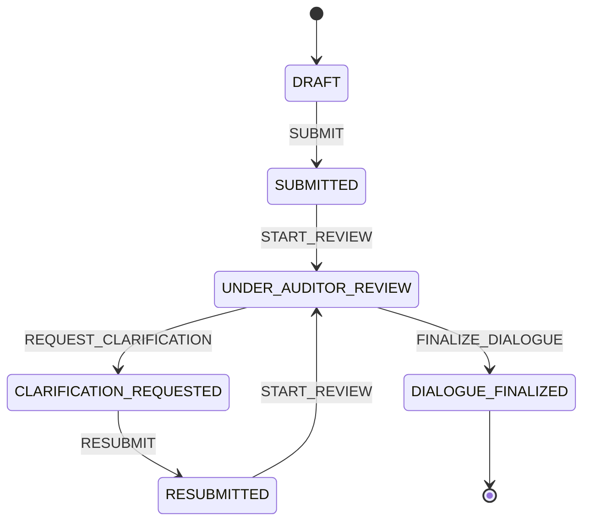

Rules:

- Only an authorized Auditee Representative for the responsible office may
  author or submit a management response.
- Submission requires agreement position, management comment, proposed action,
  responsible person/office, and proposed target date when applicable.
- The submitted response version is immutable.
- Clarification creates a new response version; it does not overwrite the
  submitted response.
- The auditor disposition is `ACCEPT`, `PARTIALLY_ACCEPT`, or `REJECT`.
- Every disposition requires a rejoinder. Partial acceptance or rejection
  requires detailed reasoning.
- Finalization locks the response, rejoinder, action, and agreed target date.
- New dialogue after finalization requires a formal finding revision before
  report issuance.

## 14. Audit Report workflow

One report family contains immutable draft versions and one issuable final
version. Report stage (`DRAFT_REPORT` or `FINAL_REPORT`) is distinct from
workflow state.

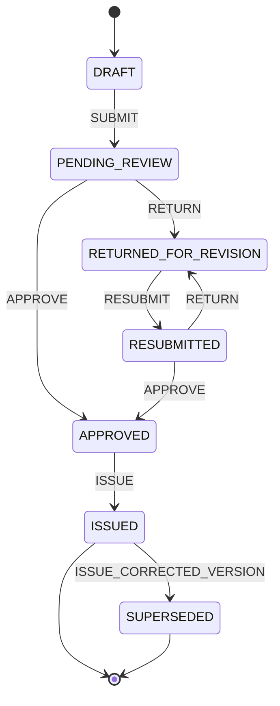

Rules:

- Draft generation selects finalized finding versions and recommendations.
- Each generated file is an immutable report version.
- Return creates reviewer comments against the submitted version.
- Final approval requires complete sections, finalized findings, a completed or
  waived exit conference, confidentiality, approving authority, and recipients.
- The approver cannot be the report preparer.
- Issue assigns the final report number, records recipients and issuance date,
  stores the checksum, locks the version, and advances the engagement.
- An issued report cannot be withdrawn by deletion. Correction requires an
  authorized version that supersedes the earlier version.
- Recommendation transfer to CMS is idempotent and stores the CMS record IDs.

## 15. Engagement Closure workflow

Closure confirms that the engagement is complete, issued, transferred, and
ready for long-term retention.

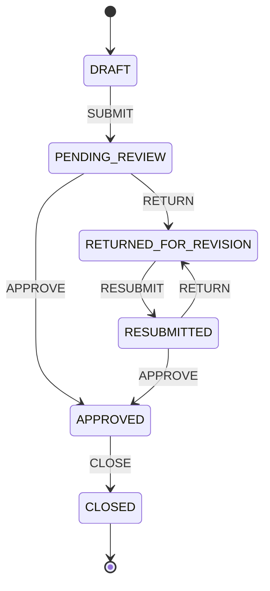

Closure submission requires:

- issued final report;
- complete recipient and issuance records;
- all findings finalized;
- all recommendations transferred to CMS or formally excluded with authority;
- all working papers approved, superseded, or voided;
- all procedures completed or waived;
- exit conference completed or formally waived;
- actual person-days recorded;
- final document index and required retention metadata;
- no active child approval workflow;
- no unresolved required reviewer comment;
- closure summary and lessons learned.

CIAS Management approves closure. Closing the closure workflow sets the
engagement to `CLOSED`. Reopening is exceptional and requires authority, a
reason, a new engagement revision, and complete audit history.

## 16. Suspension, cancellation, return, and archive semantics

### 16.1 Return

Return stores the stage, permitted resubmission state, instructions, responsible
user or role, return date, and due date. Return never unlocks an approved or
issued version.

### 16.2 Suspension

Suspension stores the prior state, reason and authority, effective date,
expected review date, affected deadlines, and recipients. Resume returns only
to the recorded prior state after rechecking prerequisites.

### 16.3 Cancellation

Cancellation is terminal for the engagement revision and records authority,
reason, disposition of work/evidence/findings/documents, IAP impact, and
notifications. An issued engagement follows correction and exceptional
reopening procedures instead.

### 16.4 Archive

Archive is recoverable soft deletion and:

- never erases files, history, or links;
- never changes workflow state;
- requires reason and permission;
- records actor and timestamp;
- does not silently reactivate work when restored.

## 17. Cross-workflow gates

| Engagement milestone   | Required child workflow state                                          |
| ---------------------- | ---------------------------------------------------------------------- |
| Authorization complete | Current AEO is `ISSUED`                                                |
| Fieldwork start        | Current AEP and Audit Program are `APPROVED`                           |
| Procedure completion   | Working paper submitted/approved or waiver approved                    |
| Issue validation       | Working papers `APPROVED`; evidence `VERIFIED` or `LOCKED`             |
| Finding communication  | Finding `VALIDATED`; recipients and due date complete                  |
| Reporting start        | Issues terminal; dialogue finalized or non-response documented         |
| Final report approval  | Included findings `FINALIZED`; exit conference complete/waived         |
| Final report issue     | Report `APPROVED`; number, recipients, confidentiality, and PDF exist  |
| Closure submission     | Report `ISSUED`; CMS transfer/exclusions complete; child work terminal |
| Engagement close       | Closure workflow `APPROVED`                                            |

The backend repeats every gate at transition time. A stale frontend completeness
indicator cannot authorize a transition.

## 18. Controlled states versus Master Lists

The following are controlled values, not editable Master Lists:

- engagement states and actions;
- AEO/AEP/program/working-paper approval states;
- issue and finding workflow states;
- response/rejoinder workflow states;
- report and closure workflow states;
- evidence lock state;
- terminal, return, suspension, cancellation, and immutability semantics.

Master Lists may configure descriptive values that do not alter the state
machine:

- audit type and engagement approach;
- special-engagement authority type;
- evidence category and source type;
- issue category;
- finding risk rating, subject to risk-scale rules;
- management agreement-position labels;
- team assignment title;
- conference participant type;
- report recipient type;
- document type and confidentiality level;
- suspension and cancellation reason category;
- closure checklist category.

Adding a Master List value must never create a backend transition.

## 19. Versioning and immutability

Versioned aggregates use a stable family ID and increasing version number. At
most one current non-archived version exists per family.

| Record              | Lock point                                           |
| ------------------- | ---------------------------------------------------- |
| AEO                 | `ISSUED`                                             |
| AEP                 | `APPROVED`                                           |
| Audit Program       | `APPROVED` and activation                            |
| Working Paper       | `APPROVED`                                           |
| Evidence file       | Every upload; selected versions lock when referenced |
| Issue               | `DISMISSED` or `CONVERTED_TO_FINDING`                |
| Finding             | Communicated version and final `FINALIZED` version   |
| Management Response | `SUBMITTED`; clarification creates a version         |
| Auditor Rejoinder   | `DIALOGUE_FINALIZED`                                 |
| Audit Report        | Every generated version; final lock at `ISSUED`      |
| Closure record      | `CLOSED`                                             |

Revision copies only the data needed for editing and never changes prior files,
references, or history.

## 20. Workflow event contract

Every controlled action writes an immutable event containing:

- event ID and module code `AEM`;
- subject type, ID, family ID, version, and display code;
- engagement ID;
- from state, to state, and action;
- actor, active role/assignment, and office context;
- comment and reason category;
- old-value and new-value snapshots;
- occurrence date, request IP, and user agent;
- optimistic lock version;
- related document/version and notification IDs.

Events are append-only. A correction creates a compensating event.

## 21. Concurrency and idempotency

- Each mutable aggregate has `lock_version`.
- The client sends its last-read version with transition requests.
- The server locks, compares, evaluates guards, writes the event, increments,
  and commits atomically.
- A stale version returns a conflict requiring refresh.
- IAP import, issue conversion, official numbering, report generation, and CMS
  transfer use unique keys and idempotency guards.
- Retrying a successful request cannot create duplicate records.

## 22. Notifications and SLA behavior

Notifications cover assignment, submission, return, approval, issuance,
procedure and working-paper deadlines, finding communication, response
deadlines, clarification, conferences, reports, suspension, cancellation, and
closure. They deep-link to an authorized record and do not expose sensitive
metadata to unauthorized recipients.

Runtime defaults may supply workflow SLAs. Engagement dates take precedence.
Extensions create history and never rewrite the original deadline.

## 23. Access, visibility, and confidentiality

Access is the intersection of account permission, module access, engagement
assignment or oversight, office scope, workflow responsibility, confidentiality,
and record state.

Auditee Representatives see only records formally communicated to their office
and explicitly released documents. They cannot see internal working papers,
review notes, unrelated evidence, draft findings, or internal report drafts.

Read-Only Users do not automatically see AEMS. Platform and AGIS administration
permissions do not imply authority to approve audit judgments.

## 24. Integration boundaries

### Core

AEMS consumes Core users, offices, audit classifications, roles, permissions,
scopes, Master Lists, documents, confidentiality, workflows, notifications,
logs, audit trails, and runtime configuration.

### IAP

AEMS imports only approved/active Annual Plan engagements and preserves lineage
and snapshots. It reports actual dates, person-days, and accomplishment without
editing the approved IAP version.

### ARMIS

ARMIS is implemented as a standalone resource and allocation module. AEMS reads
capacity, competency, requirement, assignment, and actual-person-day data through
the `ResourcePlanningGateway`, whose only operational implementation is ARMIS.
Historical IAP values are used only for reconciliation evidence. Historical AEMS
assignment snapshots remain stable.

### CMS

Only recommendations from finalized findings in an issued report transfer to
CMS. Transfer preserves all source identifiers, responsible office, risk, and
target date.

The downstream CMS-2A backend now exposes permission-scoped dashboard,
registry, detail, and Compliance Monitor assignment APIs over the separate
operational case. It never edits the immutable AEMS intake or source snapshots.
Only AEMS creates recommendation cases; CMS assignment changes do not alter the
AEMS recommendation, report, engagement lifecycle, or closure disposition.
The dedicated CMS-2B React workspace and CMS-3A Action Plan backend now consume
this immutable handoff. AEMS still cannot modify CMS plans or monitoring state.

## 25. Workflow-design acceptance criteria

Step 1 is complete when:

- all ten requested workflows have explicit states and transitions;
- engagement transitions have cross-workflow guards;
- return, suspension, cancellation, archive, revision, and reopening semantics
  are unambiguous;
- separation-of-duties and immutable lock points are identified;
- Master List and controlled-state boundaries are explicit;
- Core, IAP, ARMIS, and CMS integration boundaries are defined;
- concurrency, idempotency, history, notification, confidentiality, and access
  behavior are specified;
- unsupported states cannot be introduced through a dropdown.

## 26. Database foundation

The database foundation implements the current operational AEMS entity graph
and its coverage/evidence/finding/report junctions. It does not yet implement
every target entity in MDS-200/UID-200. The missing reference-alignment entities
and the implementation contract are listed in
[AEMS Implementation Baseline](AEMS_IMPLEMENTATION_BASELINE.md). The current
database foundation implements:

- the implemented operational AEMS entities;
- coverage and evidence/finding/report junction tables;
- a single active AEMS engagement per non-cancelled IAP source;
- PostgreSQL enforcement of planned versus special source authority;
- stable version families for AEO, AEP, working papers, evidence, findings,
  management responses, programs, and reports;
- immutable AEO, AEP, working-paper, and report version models;
- exact Core `document_versions` references and evidence checksums;
- append-only team and engagement event records;
- future CMS transfer keys and external IDs;
- soft deletion for recoverable business records;
- Eloquent relationships spanning the full engagement graph.

`AemsFoundationTest` verifies all tables, the complete model graph, IAP lineage,
evidence relationships, issue-to-finding conversion lineage, recommendation CMS
lineage, and duplicate active-source prevention.

## 27. Permissions and engagement-level access

The AEMS-6A permission catalogue contained 121 controlled AEMS operations grouped
under engagement, team, AEO, AEP, program, fieldwork, working paper, evidence, issue,
finding, management response, rejoinder, conference, and report resources.
Permission codes use the stable `aems.<resource>.<action>` convention.

The standard role baseline is:

| Role                   | AEMS access                                                                                                                                                        |
| ---------------------- | ------------------------------------------------------------------------------------------------------------------------------------------------------------------ |
| CIAS Management        | Global engagement oversight; authorization, assignment, review, approval, issuance, suspension/cancellation, reporting, and closure                                |
| AGIS User              | Only current team assignments; permitted preparation, fieldwork, evidence, issue/finding, response-dialogue, and report-drafting work according to assignment role |
| Auditee Representative | Communicated findings for their office, management responses, covered exit conferences, and issued reports addressed to their user or office                       |
| Read-Only User         | Issued reports only when their user is an explicit report recipient                                                                                                |
| Platform Administrator | Global engagement monitoring and issued-report monitoring; no AEMS audit approval or issuance authority                                                            |
| AGIS Administrator     | Global engagement monitoring and issued-report monitoring; no AEMS audit approval or issuance authority                                                            |

The application enforces access twice:

1. `visibleTo($user)` model scopes restrict collection queries before records
   are serialized.
2. Laravel policies authorize individual engagement, finding, working-paper,
   conference, and report actions.

For AGIS Users, access requires a current, non-ended `engagement_teams`
assignment. Assignment codes further restrict work:

- `TEAM_LEADER` and `SUPERVISOR` coordinate engagement records and plans;
- `AUDITOR` and `TEAM_LEADER` prepare working papers and evidence;
- `REVIEWER` and supervisory assignments perform review actions;
- CIAS Management alone performs controlled approval, authorization, issuance,
  cancellation, archival, and closure actions.

Auditee visibility begins only when a finding is `COMMUNICATED`,
`AWAITING_MANAGEMENT_RESPONSE`, `UNDER_DIALOGUE`, or `FINALIZED`, and the
finding's responsible office matches the user's office. Draft findings,
working papers, internal evidence, and draft reports remain hidden.

Read-only report access requires both `ISSUED` status and a matching
`report_recipients.user_id`. Auditee representatives may additionally match a
recipient office. Administrative global scope exposes only issued report
output, not report drafts.

Independent actions normally reject the preparer/originator as the actor. If
the active CIAS Head is the sole active CIAS Management authority, the
controlled single-head exception permits her to review or approve her own
AEMS input across planning, execution, findings, reporting, transfer, and
closure. The exception does not bypass readiness, evidence, status,
immutable-version, or audit gates and is unavailable when another active CIAS
Management authority exists.

`AemsAccessControlTest` verifies the role matrix, assigned-engagement
isolation, administrator non-approval, originator separation, auditee office
and communication boundaries, report-recipient authorization, and exit
conference office coverage.

## 28. Audit Engagement Workspace implementation

The functional Audit Engagement Workspace is available at
`/audit-engagement-management`, with detail records at
`/audit-engagement-management/{id}`.

Implemented creation paths:

- import one engagement from an approved or active Annual Internal Audit Plan;
- create a separately authorized special or unplanned engagement;
- reject a second import even when the first imported engagement is archived;
- require the special-engagement approving authority to differ from the
  registry creator.

An IAP import copies the working engagement definition and preserves:

- direct foreign keys to the Annual Plan, plan engagement, prioritization item,
  risk assessment, and Audit Universe subject;
- office, audit-area, and audit-focus coverage;
- objectives, scope, exclusions, dates, audit type/approach, and person-days;
- plan code/year/revision/approval;
- ranking decision, rank, priority score, and reason;
- inherent risk, control effectiveness, residual risk, level, justification,
  and criterion scores;
- the Audit Universe subject and source coverage.

The complete source is stored in `source_snapshot` with capture actor, time, and
schema version. Registry updates never rewrite this snapshot, so later IAP
revisions cannot silently alter the historical basis for an active audit.

The API supports permission- and assignment-scoped search, source/status/office/
area filters, whitelisted sorting, runtime pagination, full details, optimistic
updates, soft archive, and restore. Every mutation writes Activity Log, Audit
Trail, and append-only `engagement_events` entries.

`AemsEngagementRegistryTest` verifies historical snapshot stability, direct
lineage, duplicate prevention, special authority separation, filtering,
updates, archive/restore, logs, and assigned-auditor visibility.

## 29. Audit Team and AEO implementation

The Audit Team workspace maintains one active assignment per employee and
engagement. It supports the controlled roles `SUPERVISOR`, `TEAM_LEADER`,
`AUDITOR`, `REVIEWER`, `SPECIALIST`, and `AUTHORIZED_PARTICIPANT`, planned
person-days, active assignment dates, notes, updates, removal, and replacement.
Supervisor, Team Leader, and Reviewer are single-seat roles; multiple Auditors,
Specialists, and Authorized Participants are allowed.

Assignments are recoverable soft-deleted records. `engagement_team_history`
preserves assignment, update, reassignment-from, reassignment-to, and ending
events with actor, reason, and old/new snapshots.

With ARMIS as the sole operational provider, the workspace uses current ARMIS
resource data to warn about:

- missing required team roles;
- assigned versus required person-day differences;
- annual capacity over-allocation;
- overlapping AEMS assignments;
- leave, training, and unavailable dates;
- unmet IAP specialization and proficiency requirements.

Warnings support informed management decisions but do not silently change
assignments.

### AEMS-3A team safeguards and ARMIS boundary

Each active team member may submit three separate declarations:

- Objectivity;
- Conflict of Interest; and
- Independence.

Declarations record the statement, outcome (`CLEAR`, `DISCLOSED`, or
`CONFLICT`), mitigation plan where applicable, and an exact Core
`document_versions` evidence reference. Assigned resources may view their
submitted declarations but cannot review them. A declaration normally requires
an authorized reviewer; CIAS Management may prepare a declaration on behalf of
an assigned member and complete that review. Accepted declarations cannot be
edited; a correction creates a new version linked through `supersedes_id` and
preserves the accepted record.

The Team Safeguards API evaluates required roles, verified competencies and
certifications, capacity, leave/training periods, overlapping workload,
planned person-days, actual person-days, declaration completeness, and current
ARMIS provider status. A historical ARMIS reconciliation is not required. A pending assessment must be independently approved before a team
safeguard baseline is recorded; the assessment and approval are immutable
versions.

`ARMIS_AUTHORITATIVE` is the only operational mode. Missing/stale provider
data, competency/capacity/leave conflicts, unresolved independence
declarations, and unreconciled person-days are hard blockers. The aggregate
AEMS authorization and fieldwork gates, and the AEO submission gate, consume
these blockers; automation cannot approve around them. Historical fallback or
shadow values cannot become an approval-eligible provider.

API routes are documented in [API and Data Reference](API_AND_DATA_REFERENCE.md).
The focused `AemsTeamSafeguardTest` and existing ARMIS assignment/reconciliation
tests protect independent review, immutable revisions, provider modes,
capacity/competency controls, and authority separation.

#### AEMS-3B team and resource workspace

The Audit Team page presents the safeguards contract without requiring users to
leave the engagement context. It includes ARMIS provider status,
planned-versus-actual effort, competency/certification and
availability/workload evidence, declaration forms and independent review,
assessment version history, and the assignment approval panel. Every readiness
blocker includes a resolver hint (assigned resource, independent reviewer,
team lead, ARMIS/resource administrator, or supervisor), while warnings remain
advisory.

The UI calls the existing safeguards routes only. It never treats a fallback
provider as authoritative, auto-approves an assignment, edits an accepted
declaration in place, or bypasses the Core Document Version evidence check.
Assessment and approval actions remain subject to the four AEMS safeguard
permissions, engagement scope, separation of duties, optimistic locking, and
the immutable event/audit trail implemented by AEMS-3A.

The AEO workspace implements:

```text
Draft
  -> Pending Review
  -> Returned for Revision -> Resubmitted
  -> Approved
  -> Issued
```

Each content save creates a new `audit_engagement_order_versions` row. Existing
versions cannot be updated or deleted. The version snapshots the exact audit
team, engagement identity, office coverage, audit areas, authority, objectives,
scope, and planned dates.

Submission requires Supervisor, Team Leader, Auditor, and Reviewer assignments.
The current version requires an independent review event before approval.
Preparers normally cannot approve their own AEO. When the active CIAS Head is
the sole available CIAS Management authority, she may review, approve, and
issue an AEO she prepared under the documented single-authority exception.
The exception does not apply to other AEMS independent actions. CIAS
Management controls approval, issuance, and formal revision. Optimistic
`lock_version` checks reject stale workflow actions. The
workspace displays responsible account candidates and then records the actual
reviewer, approver, issuer, date, username, and position beside each immutable
signatory step.

Approved/issued PDFs are generated from the exact version referenced by the
approval event. Starting a later revision does not change the historical PDF
source or its recorded approver/issuer.

`AemsTeamAeoTest` verifies team history, reassignment, resource warnings,
independent review, approval and issuance, immutable versions, formal revision,
and approved-version PDF output.

Every controller must begin collection queries with `visibleTo($request->user())`
and authorize its record/action policy before invoking a workflow transition.

No frontend approval control should be built until its backend transition,
authorization, guard, event, and concurrency behavior exists.

## 30. Implemented AEP and Audit Program workspaces

The current implementation exposes:

```text
/audit-engagement-management/aep
/audit-engagement-management/audit-program
```

The AEP workspace is available only after the engagement AEO is issued. It
captures objectives, scope and exclusions, methodology, audit criteria,
materiality, sampling, execution and reporting dates, planned person-days,
resource requirements, management coordination, confidentiality, and an
immutable snapshot of the IAP risk assessment, prioritization decision, and
Audit Universe record. Content saves append
`audit_engagement_plan_versions`; an approved version cannot be overwritten.

The controlled AEP actions are:

```text
DRAFT -> PENDING_REVIEW -> RETURNED_FOR_REVISION -> RESUBMITTED -> APPROVED
```

The preparer cannot perform independent review or approval. Approval requires
an independent review event for the exact current version. A change after
approval starts a formal draft revision and retains the approved version.

An Audit Program requires an approved AEP. Each program contains stable,
ordered procedure numbers, objectives, descriptions, expected evidence,
assigned Team Leader/Auditor, target dates, working-paper references,
completion states, waivers, and independent reviewer results.

Program approval establishes the immutable fieldwork baseline:

```text
DRAFT -> PENDING_REVIEW -> RETURNED_FOR_REVISION -> RESUBMITTED -> APPROVED
APPROVED -> ACTIVE -> COMPLETED
```

Definition fields and procedures cannot be edited after approval. During
fieldwork, only progress, working-paper references, waiver dispositions, and
review results change. A material change to an approved or active baseline
creates a new `audit_programs` revision, copies the procedures into the draft
revision, requires a reason, and marks the old revision `SUPERSEDED`. The old
program and its procedure results remain available as historical evidence.

`AemsAepProgramTest` verifies the issued-AEO prerequisite, automatic risk
lineage, independent AEP/program review, immutable AEP versions, program
baseline locking, responsible-auditor progress, independent procedure review,
and documented program revision preservation.

## 31. Implemented Working Papers and Audit Evidence workspace

The fieldwork workspace is available at:

```text
/audit-engagement-management/working-papers
```

Working Papers are linked to procedures in the current active Audit Program and
receive an engagement-unique generated index. Every content save appends an
immutable `working_paper_versions` row containing the objective, procedure
performed, population, sample, results, conclusion, cross-references, preparer,
preparation date, and exact evidence-version links.

The controlled workflow is:

```text
DRAFT -> SUBMITTED -> RETURNED_FOR_REVISION -> RESUBMITTED -> APPROVED
DRAFT or RETURNED_FOR_REVISION -> VOIDED
```

Submission requires complete population/sample documentation and exact
`VERIFIED` or `LOCKED` evidence versions, or a documented explanation that no
attachment is required. The preparer cannot return, void, or approve their own
paper. Approval records the reviewer and date, locks the paper, and changes each
cited verified evidence row to `LOCKED`. An approved paper cannot be edited.
A correction copies the approved content and exact evidence links into a new
draft version while the earlier approved version and event remain immutable.

Evidence records capture evidence category, source type and description, date
obtained, custodian, confidentiality, SHA-256, file size, MIME type, uploader,
verification, Working Paper links, Finding links, and immutable replacement
lineage. Files are private hidden AEMS-owned Core documents. Replacement appends
a new Core `DocumentVersion` and `AuditEvidence` version; it never overwrites or
unlocks the version relied upon by an approved paper.

`AemsWorkingPaperEvidenceTest` verifies active-program and assignment gates,
checksum verification, exact version/evidence locking, preparer separation,
approved-content immutability, correction revisions, evidence replacement,
duplicate checksum rejection, and the Audit Program completion gate.

## 32. Implemented Issues, Findings, and Recommendations workspace

The findings-communication workspace is available at:

```text
/audit-engagement-management/findings
```

Issues receive an engagement-unique index and preserve exact Working Paper
version and evidence links. They follow `DRAFT → SUBMITTED → VALIDATED`, after
which an independent reviewer either dismisses them with a reason or converts
them exactly once to a Finding. Dismissed and converted records are immutable.

Findings record criteria, condition, cause, effect, risk rating, responsible
office, exact approved Working Paper versions, and exact verified evidence.
They follow `DRAFT → PENDING_REVIEW → VALIDATED → COMMUNICATED →
AWAITING_MANAGEMENT_RESPONSE → UNDER_DIALOGUE → FINALIZED`. Validation is
independent from authorship and locks cited verified evidence. Communication
stores recipients, confidentiality, response due date, recommendation content,
and all exact supporting IDs in a snapshot.

Responsible-office Auditee Representatives can author the management response.
Clarification retires the current response and creates an immutable successor
version. Auditors record an `ACCEPT`, `PARTIALLY_ACCEPT`, or `REJECT` rejoinder;
independent finalization locks both response and rejoinder. A documented
non-response is the alternate dialogue gate.

Recommendations remain editable until Finding finalization. Finalization stores
finding and recommendation snapshots, marks recommendations `FINALIZED`, and
prevents content changes while preserving the CMS transfer key and transfer
metadata for the later integration step.

`AemsIssueFindingRecommendationTest` verifies support gates, author/validator
separation, idempotent conversion, evidence locking, communication, auditee
response revision, rejoinder finalization, and finalized recommendation
immutability.

## 32A. AEMS-6A Issue dispositions and immutable Finding revisions

Validated issues may now be disposed as `CONVERTED_TO_FINDING`, `MERGED`,
`RESOLVED_DURING_AUDIT`, `OBSERVATION`, `REFERRED`,
`CLOSED_WITHOUT_FINDING`, or `DISMISSED`. The existing `DISMISSED` and
`CONVERTED_TO_FINDING` status values remain compatibility statuses; the
structured `disposition`, reason, actor/date, referral, resolution, and merge
target fields preserve the professional outcome. Merge targets must be a
different active issue in the same engagement. Every disposition is terminal
and immutable.

Findings now include conclusion, significance and effect classifications, and
direct links to exact AEMS Fieldwork Record versions. A correction, amendment,
supersession, or withdrawal is created through:

```text
POST /api/aems/engagements/{engagement}/findings/{finding}/revisions
```

with `CORRECT`, `AMEND`, `SUPERSEDE`, or `WITHDRAW` and a mandatory reason.
The service releases the prior current pointer atomically, creates a new
family revision with a captured `revision_snapshot`, copies exact support
links, and leaves the prior row and any finalized recommendation snapshot
untouched. Withdrawal creates a terminal `WITHDRAWN` revision; other revision
types begin as an editable `DRAFT`. Finalized recommendations are never
updated or overwritten. Recommendation content is captured in the immutable
revision snapshot; recommendations are not silently duplicated or assigned a
second CMS transfer lineage.

The `aems.finding.revise` permission is engagement-scoped. Finding validation
continues to require a reviewer different from the author, and finalized or
withdrawn finding/recommendation content remains immutable. The AEMS-6A
regression coverage verifies all new metadata, author/validator separation,
atomic revision creation, withdrawal, and prior-revision preservation.

## 33. Implemented Auditee Response workflow

Auditee dialogue has a dedicated workspace:

```text
/audit-engagement-management/auditee-responses
```

Auditee Representatives see only formally communicated Findings whose
responsible office matches their office. They can record agreement, partial
agreement, or disagreement; management comments; proposed corrective action;
responsible personnel; target implementation date; and clarification responses.
Submitted responses are historical versions. A clarification request retires
the current response and creates an editable successor rather than overwriting
the prior exchange.

Authorized auditors can accept, partially accept, reject, request
clarification, add a rejoinder, and independently finalize the dialogue.
Finalization locks the response and rejoinder before the Finding can be
finalized.

Response and rejoinder supporting documents are private. Each upload creates an
immutable Core `DocumentVersion`, records its SHA-256 checksum, size, MIME type,
uploader, and upload date, and pins it to exactly one exchange version through
`aems_dialogue_attachments`. The dialogue API therefore preserves actor, date,
content, attachments, and version for every exchange.

## 34. Implemented Exit Conference management

Exit Conference management has a dedicated workspace:

```text
/audit-engagement-management/exit-conferences
```

Authorized engagement supervisors and team leaders can schedule or reschedule a
physical, online, or hybrid conference; set the agenda; select current formally
communicated Findings; and invite internal or external participants. Auditee
Representatives see conferences covering their office and the Findings directly
linked to each conference.

Completion requires:

- attendance for every invited participant;
- a discussed or not-discussed outcome for every linked Finding;
- agreement, partial-agreement, or disagreement status for each discussed
  Finding;
- details for every partial agreement or disagreement;
- any revised target implementation date;
- a discussion summary and conference minutes.

Completion stores an immutable snapshot containing the schedule, agenda,
attendance, Finding outcomes, agreements and disagreements, revised dates,
minutes, and exact attachment document-version IDs. Completed, cancelled, and
waived conference records are locked.

Minutes files and supporting documents use private storage. Each upload creates
a hidden Core `Document` and immutable `DocumentVersion` with file name, size,
MIME type, SHA-256 checksum, uploader, and upload date. An invited Auditee
Representative can acknowledge completed minutes once, either without
qualification or with reservations. Each acknowledgement preserves actor,
office, date, comment, status, and version and cannot be overwritten.

`AemsExitConferenceTest` verifies communicated-Finding selection, scheduling
and rescheduling, participants, attendance, finding discussions, revised target
dates, immutable files, completion locking, office access, downloads, audit
events, and auditee acknowledgement.

## 35. AEMS-1A foundation contract implementation

AEMS-1A adds the additive foundation contract described in
[AEMS Implementation Baseline](AEMS_IMPLEMENTATION_BASELINE.md). The migration
`2026_08_19_000000_add_aems_foundation_contract` adds:

- `engagement_office_id` as the canonical Engagement Office reference;
- `phase` as the lifecycle projection used by future engagement navigation;
- `administrative_status` as the administrative projection separate from the
  existing detailed `status` workflow value;
- a unique primary-office integrity index for the legacy office pivot;
- PostgreSQL checks for supported phase and administrative-status values.

Existing `status`, `audit_engagement_offices`, routes, and compatibility
permissions remain intact. Existing historical multi-office rows are preserved
and reported as `LEGACY_MULTI_OFFICE`; new registry creates and updates require
exactly one office. Import and special-engagement creation populate the
canonical office and lifecycle projections. Aggregate transitions, closure,
archive/restore, reopening, dashboard responses, resources, and audit snapshots
keep the projections synchronized with the legacy status.

The foundation permission family is:

```text
aems.foundation.view
aems.foundation.manage_scope
aems.foundation.reconcile
```

Scope management remains assignment- and role-controlled. Reconciliation is a
CIAS Management action. The existing `aem.*` compatibility permissions are not
removed or renamed.

`AemsFoundationContractTest` verifies the new columns, lifecycle projection,
permission catalogue, and single-office validation. The AEMS-1B sidebar and
SCR navigation UI consumes these fields as documented below.

## 36. AEMS-1B shell, navigation, and engagement registry

AEMS-1B implements the React shell for the foundation contract without creating
duplicate operational pages. The AEMS sidebar now groups the existing screens
under Portfolio, Foundation, Planning, Execution, Issues & AFR, Conferences,
and Reporting. At the AEMS-1B shell checkpoint, reference-only screens such as
Process Flow, Risk Matrix, Fieldwork Records, Evidence Requests, Distribution
Decision, and Completion Transfer were intentionally not exposed as dead links.
Process Flow and Risk Matrix are now supplied by the AEMS-2B workspace, the
AEMS-4A/4B phases supply versioned Fieldwork Records and their Execution
Workspace, and AEMS-5A supplies the Evidence Request/assessment backend. The
remaining reference-only screens are future phases.

The engagement detail route is the engagement-centered SCR-220 workspace. Its
workspace tabs deep-link to the existing authorized portfolio pages while
preserving the current query-based compatibility routes:

```text
Overview · Planning · Execution · Audit Issues · AFRs · Conferences ·
Audit Reports · Completion & Transfer · Activity
```

The registry displays the server-maintained lifecycle phase, administrative
status, canonical office, and legacy multi-office warning. Phase and
administrative filters are client-side views of the API contract; Laravel
continues to enforce scope, permission, and action eligibility.

`src/config/navigation.js` exports the frontend SCR registry as
`aemsScreenRegistry`. It is a usability and route-inventory contract only and
does not replace backend authorization.

## AEMS-2A Planning Package backend

The Planning Package is an AEMS-owned, versioned planning baseline. It imports
IAP lineage as a read-only snapshot (`sourceType`, plan engagement, plan,
prioritization, risk-assessment, universe-item identifiers, and source
snapshot); it never updates IAP records and a package is unique per engagement.
Special-authority engagements retain `SPECIAL` lineage and may add
engagement-specific planning attributes.

Each package version can contain a preliminary survey, process-flow documents,
planning objectives, a risk matrix and risk items. Risks link to objectives,
current-engagement Audit Program procedures, and working-paper references. Core
evidence is referenced by exact immutable `DocumentVersion` IDs, never public
file URLs.

The workflow is `DRAFT → PENDING_REVIEW → APPROVED`, with return/resubmit
revision states. Submission and approval require valid lineage, complete
survey, objectives, process flows, a risk matrix, objective/procedure/
working-paper links for every risk, and approved AEP and Audit Program.
Review is an immutable independent assessment; the preparer cannot review or
approve the same version. Approval records a separate final decision and
`approved_version_number`. Approved versions cannot be updated or deleted.
Formal revision copies the approved content into a new DRAFT while retaining
the previous approved version and decision metadata.

Aggregate `START_FIELDWORK` is blocked unless the package is APPROVED and its
current version equals its approved version. Create, version, review, return,
approval, revision, and gate failures write AEMS events, Activity Log, Audit
Trail, and controlled Core notifications where applicable.

## AEMS-2B Planning Package UI

The route `/audit-engagement-management/planning-package` is the engagement-
scoped Planning Package workspace. It exposes the shared engagement navigation,
overview and objectives, preliminary survey, process-flow editor/viewer,
risk-matrix register and item detail, source and risk traceability, backend
readiness checklist, review/approval queue, and immutable version history and
comparison. Draft and returned packages can be edited and saved as new
immutable versions. Reviewers can record an independent review or return the
package; approvers can approve only after the server readiness and separation-
of-duties checks pass. Approved versions are read-only in the UI. A formal
revision creates a new editable draft while retaining the approved baseline.

The frontend never decides readiness, scope, workflow eligibility, or fieldwork
authorization; it presents the server contract and surfaces optimistic-lock
refresh errors. Exact Core `DocumentVersion` IDs remain the only document
references exposed by the planning editors.

## AEMS-4A Fieldwork Records backend

Fieldwork Records are the execution evidence for the current Audit Program.
Each record is scoped to one engagement and one active Audit Program procedure
and is classified as `INTERVIEW`, `OBSERVATION`, `WALKTHROUGH`, `INSPECTION`,
`TESTING`, `SAMPLING`, or `ANALYSIS`. A record version captures the performed
date, location, objective, procedure performed, population and sample,
analysis, result, conclusion, execution status, participants, related tasks,
related records, Audit Area, Audit Focus, Working Paper version links, and
Evidence links. Reviewer notes are retained on the record workflow metadata
and its immutable review event. Evidence links resolve to the exact Core `DocumentVersion`
through the immutable `AuditEvidence` row; public file URLs are never exposed.

The record workflow is:

```text
DRAFT -> SUBMITTED -- independent REVIEW recorded --> FINALIZED
             |
             +-> RETURNED_FOR_REVISION -> RESUBMITTED
                                              |
                                    FINALIZED -> DRAFT (formal REVISE)
```

Submission requires completed execution, at least one participant, Working
Paper traceability, and Evidence traceability. Review is independent of the
preparer. A return records a reason and creates a resubmittable returned
state. Finalization requires an independent review, a different finalizer,
approved linked Working Papers, and verified or locked linked Evidence. Every
content correction creates a new immutable version; finalized versions are
never edited in place.

The procedure contract now exposes `fieldworkStatus`, `fieldworkResults`,
`fieldworkConclusion`, `fieldworkReviewState`, related tasks/records,
completion actor/time, and finalized-record count. A procedure may not be
progressed to `COMPLETED` unless at least one finalized Fieldwork Record points
to it. Finalizing a record atomically updates the procedure execution fields;
optimistic lock versions are checked for both the record and procedure/program.

Protected routes are:

```text
GET  /api/aems/engagements/{engagement}/fieldwork
POST /api/aems/engagements/{engagement}/fieldwork
PUT  /api/aems/engagements/{engagement}/fieldwork/{record}
POST /api/aems/engagements/{engagement}/fieldwork/{record}/transition
```

The `aems.fieldwork.view`, `.create`, `.review`, and `.finalize` permissions
are engagement-scoped. Events, Activity Log, Audit Trail, and controlled Core
notifications record the actor, action, status transition, version, comment,
and procedure context.

## AEMS-4B Execution Workspace UI

The route `/audit-engagement-management/execution` is the engagement-scoped
Fieldwork Execution Workspace. It keeps the selected engagement, procedure, and
Fieldwork Record in the URL so auditors can move between execution, the Audit
Program, Working Papers/Evidence, and Audit Issues without losing context.

The workspace provides:

- active-procedure register with target dates, fieldwork state, related tasks,
  and completed-procedure traceability;
- Fieldwork Record list/detail views with immutable version number, narrative,
  participants, execution status, reviewer notes, linked Working Papers and
  Evidence, and the event timeline;
- draft/edit, submit, review, return, resubmit, finalize, and formal correction
  actions that call the existing protected AEMS-4A API and preserve server-side
  scope, separation-of-duties, readiness, and optimistic-lock decisions;
- task title, assignee, and due-date capture stored in the versioned related-task
  snapshot, plus overdue procedure and execution-blocker summaries;
- direct procedure-to-Audit Program, Working Paper/Evidence, and Issue links;
  **Create issue from Fieldwork** pre-fills the linked Working Paper version and
  Evidence IDs while leaving issue validation and workflow independent.

The UI is a contract client rather than a second authorization layer. It does
not mark a procedure complete, approve a record, or bypass the immutable
version/traceability rules enforced by the backend. The focused browser smoke
contract is `tests/e2e/aems-execution.spec.js`; it verifies linked context,
record detail, timeline, and issue navigation.

## AEMS-5A Evidence Requests and evidence assessment backend

Evidence Requests are separate from `AuditEvidence`. A request records the
information sought from a custodian, its due date, request versions, exact
received evidence links, and its own controlled lifecycle:

```text
DRAFT -> SUBMITTED -> SENT -> ACKNOWLEDGED -> PARTIALLY_RECEIVED -> RECEIVED
       -> FOR_REVIEW -> ASSESSED -> CLOSED
```

`SUBMITTED` is the compatibility label for `FOR_REVIEW`. The lifecycle also
supports controlled `OVERDUE`, `EXTENSION_REQUESTED`, `EXTENDED`, `ESCALATED`,
`CANCELLED`, and `CLOSED_WITHOUT_SUBMISSION` states; these are reviewable
actions and do not make a professional acceptance decision automatically.

`aems_evidence_request_versions` preserves each request content revision.
`aems_evidence_request_evidence` pins each received item to both the current
`audit_evidence` row and the exact Core `document_versions` row. The link is
rejected if the evidence has been replaced, voided, or the submitted document
version is not its current exact version.

Professional assessment is stored in immutable
`aems_evidence_assessments` versions. The assessment captures sufficiency,
appropriateness, relevance, reliability, competence, accuracy, completeness,
corroboration, contradiction, authenticity, integrity, confidentiality,
access restrictions, limitations, evidence gaps, and (when needed) a separate
exception requirement and reason. Corrections supersede the prior assessment
version and preserve its history.

The Evidence Request cannot move to `ASSESSED` until every received exact
version has a current eligible assessment. Evidence uploaded through the AEMS
evidence service is marked `assessment_required`; Finding validation requires
that evidence to be assessed against the exact Core version. Restricted or
access-restricted evidence additionally requires a separately authorized
exception approval. The assessor cannot approve their own exception. This
gate prevents unassessed or restricted evidence from entering a finalized
Finding without an approved exception. Legacy evidence rows created before
AEMS-5A retain `assessment_required = false` as a compatibility marker and
continue to use their existing verification/locking controls.

Protected backend routes are:

```text
GET  /api/aems/engagements/{engagement}/evidence-requests
POST /api/aems/engagements/{engagement}/evidence-requests
PUT  /api/aems/engagements/{engagement}/evidence-requests/{evidenceRequest}
POST /api/aems/engagements/{engagement}/evidence-requests/{evidenceRequest}/transition
POST /api/aems/engagements/{engagement}/evidence-requests/{evidenceRequest}/evidence
POST /api/aems/engagements/{engagement}/evidence-assessments
POST /api/aems/engagements/{engagement}/evidence-assessments/{assessment}/approve-exception
```

The request family uses `aems.evidence-request.*`; assessment and exception
approval use `aems.evidence.assess` and
`aems.evidence.exception_approve`. Request visibility is engagement- and
assignment-scoped. Assessment and exception approval are independent actions;
closure and exception approval are CIAS-controlled. Every transition,
assessment, exact-document link, and exception decision writes AEMS events,
Core Activity Log, Audit Trail, optimistic-lock metadata, and controlled
notifications. No public document or download URL is returned.

## AEMS-5B Evidence Management workspace

The route `/audit-engagement-management/evidence` is the engagement-scoped
Evidence Management workspace. It consumes the AEMS-5A request and assessment
contracts and keeps the engagement in the URL. The workspace provides:

- an Evidence Request register with request lifecycle status, due dates,
  receipt progress, request versions, requested items, and receipt notes;
- submission tracking for partial and complete receipt, exact Evidence/Core
  Document Version links, custody notes, and checksum display;
- an Evidence Register that distinguishes requested, received, assessed,
  restricted, insufficient/gapped, and accepted-for-reporting evidence;
- a professional assessment form for the complete AEMS-5A assessment
  attributes, with exact current Core Document Version pinning;
- restricted-evidence and exception-approval views that clearly show when
  reporting use remains blocked;
- evidence-gap and limitation views, assessment version history, and a
  comparison of Evidence family versions/checksums;
- links back to Working Papers, Fieldwork, Issues, Findings, and Reports.

The React page only presents actions allowed by the current permission and
request/evidence state. Laravel remains authoritative for assignment scope,
optimistic locks, evidence-version integrity, independent assessment,
exception approval, and Finding validation eligibility. Protected downloads
continue to use the existing authenticated evidence endpoint; the workspace
does not expose public file URLs.

## AEMS-6B Issues and AFR workspace

The Issues route (`/audit-engagement-management/issues`) is a dedicated
issue register and detail workspace. It shows supported exception text,
responsible office, risk, exact Working Paper/Evidence links, workflow history,
and the server-defined terminal disposition. Validated issues expose only the
permission- and status-eligible actions: convert to finding, dismiss, merge,
resolve during audit, record observation, refer, or close without finding.
Merge, referral, and resolution actions collect their required target or
explanation before calling the protected transition endpoint. The author is
shown a separation-of-duties notice and cannot validate or disposition their
own issue.

Findings & Recommendations remains a separate route
(`/audit-engagement-management/findings`). Its detail panel presents the full
criteria, condition, cause, conclusion, effect, risk and significance
classification, exact Evidence/Working Paper links, direct Fieldwork Record
versions, recommendations, management comments, and auditor rejoinders.
Lifecycle buttons are status- and permission-aware, and the finding author is
prevented from performing review, communication, or finalization actions in
the UI as well as by the backend policy.

Finalized, withdrawn, and superseded findings display an immutable snapshot
indicator. Draft recommendations remain editable only while their finding and
recommendation are mutable. A `Create revision` action opens a controlled
correction, amendment, supersession, or withdrawal decision and requires a
reason; it calls `POST /api/aems/engagements/{engagement}/findings/{finding}/revisions`.
The immutable revision history shows family revision number, type, reason,
status, and timestamp. The UI never overwrites a finalized finding or
recommendation and never bypasses server optimistic locking, scope, or
separation-of-duties checks.

## AEMS-7A Conferences, dialogue, and work queues backend

AEMS conferences and dialogue records remain the authoritative exchange
boundary. Existing Entry Conference and Exit Conference services retain their
schedule, attendance, minutes, finding discussion, acknowledgement,
attachment, immutable-terminal-state, Activity Log, Audit Trail, and
Engagement Event behavior. Management Responses and Auditor Rejoinders remain
versioned records linked to exact Core `document_versions` through the
existing dialogue attachment contract.

The additive AEMS-7A migration `2026_08_24_000000_create_aems_work_queue_tables`
adds engagement tasks and append-only task events, immutable review-note
families and attachments, no-response due-process exchanges and attachments,
and reviewable escalation candidates. Every new task event, review note,
due-process exchange, candidate decision, and exact-document attachment
records actor, recorded time, version/lock, engagement, subject links, and
content or reason. Core Activity Log, Audit Trail, and Engagement Events are
written for every state-changing operation.

Task due reminders and overdue candidate creation run through the existing
Core notification worker and are deduplicated by subject and due date.
Candidates can be acknowledged, resolved, or dismissed by an authorized
reviewer, but never issue a notice or close a finding automatically. Finding
`RECORD_NON_RESPONSE` atomically creates a `FINAL_NON_RESPONSE` exchange and
candidate while preserving the finding transition.

Protected routes are:

```text
GET  /api/aems/engagements/{engagement}/work-queue
POST /api/aems/engagements/{engagement}/tasks
PUT  /api/aems/engagements/{engagement}/tasks/{task}
POST /api/aems/engagements/{engagement}/tasks/{task}/transition
POST /api/aems/engagements/{engagement}/review-notes
PUT  /api/aems/engagements/{engagement}/review-notes/{note}
POST /api/aems/engagements/{engagement}/review-notes/{note}/transition
POST /api/aems/engagements/{engagement}/review-notes/{note}/revisions
POST /api/aems/engagements/{engagement}/review-notes/{note}/attachments
POST /api/aems/engagements/{engagement}/due-process
POST /api/aems/engagements/{engagement}/due-process/{item}/attachments
POST /api/aems/engagements/{engagement}/escalation-candidates/{candidate}/review
```

The four new permission families are `aems.task.*`, `aems.review-note.*`,
`aems.due-process.*`, and `aems.escalation-candidate.*`. The AEMS-7B React
workspace consumes these server-scoped records; it does not replace the
existing action workspaces or duplicate their authorization decisions.

## AEMS-7B Conference and dialogue workspace

`/audit-engagement-management/conferences` is the engagement-scoped review
workspace for the complete conference and dialogue sequence. It combines the
existing Entry Conference, Exit Conference, Finding response, Rejoinder, and
AEMS-7A work-queue contracts without changing their operational APIs. An
engagement selector keeps every view in context and the workspace provides:

- an engagement timeline covering Entry Conference history, Exit Conference
  scheduling/completion/acknowledgement, management responses, clarification
  requests, auditor rejoinders, and due-process exchanges;
- Entry Conference and Exit Conference timeline cards with participants,
  attendance/acknowledgements, findings discussed, agreements, disagreements,
  revised target-date context, minutes, and links to the detailed action
  workspaces;
- an Auditee dialogue view showing response versions, management comments,
  proposed corrective actions, clarification history, and auditor rejoinders;
- review queues for overdue management responses, open engagement tasks,
  review notes, and escalation candidates;
- an AEMS notification-center panel showing recent scoped AEMS notifications
  and a protected link to the full notification center.

The page is intentionally an aggregate navigation and monitoring surface.
Creating, editing, acknowledging, finalizing, and attaching documents still
use the existing protected Entry/Exit Conference and Finding dialogue pages.
The React layer does not infer permission, communication, or office scope.
Laravel returns only records authorized for the current user and engagement.
In particular, auditee users receive only findings formally communicated to
their office; the UI renders an explicit empty state when none are visible and
does not broaden that result client-side. Focused coverage is in
`tests/e2e/aems-conference-dialogue.spec.js`.

## AEMS-8A/8B Interim, Final, and distribution reporting

AEMS reporting now supports three controlled assembly stages:

```text
INTERIM_REPORT or DRAFT_REPORT -> PENDING_REVIEW -> RETURNED_FOR_REVISION
                              -> RESUBMITTED -> APPROVED
FINAL_REPORT                  -> PENDING_REVIEW -> RETURNED_FOR_REVISION
                              -> RESUBMITTED -> APPROVED -> ISSUED
```

Interim and Draft Reports use the existing section assembly, ordering,
executive-summary, quality-review checklist, reviewer-comment, confidentiality,
and immutable PDF version contract. A Final Report can be generated only from
an approved Interim or Draft Report and can include only current `FINALIZED`
Findings. Final approval still requires the approving authority, controlled
recipients, and a completed or waived Exit Conference.

Issuance locks the exact report version, preserves its PDF checksum, and marks
recipient delivery. Delivery and acknowledgement decisions are append-only
records tied to the exact report version and recipient. Internal distribution
staff may record delivery; only the authorized recipient or covered office may
acknowledge. Confidentiality and protected authenticated downloads remain
enforced by the existing Core Document Version and AEMS access services.

An issued report cannot be edited. Withdrawal records a separate immutable
withdrawal decision while retaining the issued version. Amendment and
supersession reopen the existing report family in a controlled draft state and
create a new immutable successor version linked to the source version; the
source issued version is never overwritten. These controlled
successor decisions require a reason, optimistic locking, permissions,
Activity Log, Audit Trail, and Engagement Event records.

The Reporting Workspace at `/audit-engagement-management/reports` provides
Interim/Draft/Final assembly, section arrangement, executive summary,
quality checklist, reviewer comments, distribution/acknowledgement controls,
version comparison, controlled amendment/withdrawal/supersession actions, and
protected PDF download. Detailed workflow authorization remains server-side.

## AEMS-9A Completion, CMS transfer, effort reconciliation, and closure gate

Completion is split into two controlled surfaces: Completion Assessment and
Completion & Transfer. The latter reconciles the issued Final Report against
the AEMS recommendation ledger and the configured resource provider before the
formal Closure workflow may proceed.

The CMS transfer manifest is one lineage snapshot for an engagement and issued
report version. Every current recommendation must be either `FINALIZED` and
transferred through the existing idempotent CMS gateway, or `EXCLUDED` with an
authority, reason, actor, and timestamp recorded by the AEMS exclusion workflow.
Anything else creates an open `TRANSFER_INCOMPLETE` exception. Retrying the
reconciliation reuses the existing manifest and CMS transfer key; it does not
create duplicate CMS cases. An approved manifest is locked. An independent
reviewer/final approver is required and the generator cannot approve the same
snapshot.

Effort reconciliation records planned person-days, AEMS actual person-days,
ARMIS actual person-days, variance, provider mode, and source status. ARMIS is
the only provider that can satisfy the closure gate; stale or missing ARMIS
data remains a blocker. Approved effort snapshots are immutable.

The authoritative closure checklist derives three blocking checks from this
boundary: `CMS_TRANSFER_MANIFEST`, `CMS_TRANSFER_EXCEPTIONS`, and
`EFFORT_RECONCILIATION`. The checklist also continues to enforce report
issuance, finalized findings, completed dialogue, retention approval, final
document-index readiness, and the approved Completion Assessment. No client
checkbox can override these checks.

Protected endpoints:

```text
GET  /api/aems/engagements/{engagement}/completion-transfer
POST /api/aems/engagements/{engagement}/completion-transfer/reconcile
POST /api/aems/engagements/{engagement}/completion-transfer/{MANIFEST|EFFORT}/{id}/approve
```

The AEMS-9B engagement tab displays transfer counts, open exceptions, exact
report/version lineage, provider mode, planned-versus-actual variance, and
independent approval controls. It explains why the engagement is not ready
for closure and links to the separate formal Closure workspace. Closure and
controlled reopening remain distinct: reopening creates a new immutable
decision and never overwrites the original closure decision.

## AEMS-10A/10B Dashboard, work queues, and reminder controls

The AEMS Dashboard is a backend-derived portfolio view. It does not persist
dashboard counters or use client-side mock data. Every value is calculated from
the authenticated user's visible active engagements and related child records.
The response includes active/planning/fieldwork cards, phase distribution,
overdue procedures, Working Papers awaiting review, Evidence Requests awaiting
response, evidence gaps and restrictions, findings awaiting review or
management response, upcoming Entry and Exit Conferences, reports pending
approval, open CMS transfer exceptions, review notes, tasks, escalation
candidates, closure-ready engagements, and the actor's notification summary.

The protected endpoints are:

```text
GET /api/aems/dashboard
GET /api/aems/dashboard/export
GET /api/aems/dashboard/queues/export
```

`status`, `phase`, `officeId`, and search filters are applied server-side. The
phase groups are Planning, Fieldwork, Reporting, Closure, and Other. Both CSV
endpoints require `aems.engagement.export`, use the same authenticated scope
as the dashboard, write Activity Log/Audit Trail records, and prefix values
that begin with spreadsheet formula characters to mitigate formula injection.

The responsive dashboard uses auto-fitting hoverable progress cards, phase
summary cards, queue panels with empty/loading/error states, due and overdue
links, notification monitoring, and the existing engagement tracker. Queue
items deep-link to protected module workspaces; no public document or export
URL is emitted. Empty queues are rendered explicitly and card widths expand to
the available row, so role-specific portfolios do not leave hidden columns.

Reminder dispatch continues through Core `notifications:dispatch-reminders`.
The following administrator-managed runtime settings are available in Core
System Configuration under Notifications:

| Key | Default | Effect |
| --- | ---: | --- |
| `aems_reminders_enabled` | `true` | Pause/resume AEMS reminders without changing workflow state |
| `aems_reminder_due_hours` | `48` | Due-soon window for open tasks and procedures |
| `aems_response_reminder_days` | `3` | Management-response reminder window |
| `aems_conference_reminder_days` | `7` | Entry/Exit Conference reminder window |

Rules only generate reminders, queue signals, and reviewable escalation
candidates. They cannot approve, finalize, close, transfer, or issue any
professional record. Existing user notification preferences, deduplication,
after-commit delivery, scope checks, and audit records remain in force.

## AEMS-11 Cross-module integration and security

AEMS consumes Core users/offices, roles and scope rules, document versions,
workflow infrastructure, notifications, runtime configuration, numbering,
Activity Log, and Audit Trail through existing container-bound services. It does
not create parallel Core tables or authorization paths.

The IAP gateway is read-only. An approved IAP engagement is locked, copied into
an AEMS-owned `audit_engagements` relationship, and preserved in an immutable
source snapshot. The legacy `iap_plan_engagements.aem_engagement_id` column is
retained but is no longer written by AEMS; the model exposes a computed
compatibility link for existing IAP views. The active-source unique index and
transactional import guard prevent duplicate imports. Planning Package
versions preserve Process Flow, risk, objective, procedure, working-paper, and
exact Core Document Version references without mutating IAP or either of the
coexisting IAP risk systems.

ARMIS competency, availability, workload, planned/actual person-days, and
reconciliation are consumed through `ResourcePlanningGateway`. ARMIS is the sole
operational provider; provider activation/rollback decisions are disabled. CMS receives only finalized
recommendations from the exact locked issued report version. Its immutable
intake envelope contains the AEMS source lineage and source-snapshot hash, and
the transfer key/source identity make retries idempotent.

`GET /api/aems/integrations/status` is protected by the existing AEMS view
permission and scope policy. It reports ARMIS provider ownership,
referential-health checks, historical compatibility indicators, and security
flags; scoped users do not receive global IAP/CMS counts. AIS remains outside
AEMS workflow ownership; its provider, snapshots, routes, and read-only
contract are maintained by AIS phases.

## AEMS-G1 professional-control hardening

Finding validation and finalization now require professionally eligible
Evidence. The current Evidence revision must be verified or locked, its
immutable assessment must be assessed against the exact current Core Document
Version, all professional dimensions must be positive, confidentiality must
be classified, and gaps/limitations/restrictions must be resolved or covered
by an independently approved exception. The API exposes the eligibility
boolean and blocking reasons; the Findings workspace removes ineligible
Evidence from reporting-support selection and suppresses Validate/Finalize
actions until the gate is met.

Finding Conclusion is required at creation and before Submit, Validate, or
Finalize. Direct Findings require one of the G0-authorized reasons and an
authority reference; the actor and timestamp are retained. A Finding created
from an Issue must reference a validated Issue in the same engagement.

Evidence Request and Assessment versions are immutable records. Corrections
and exception approvals create superseding versions, preserving the original
assessment and exact Document Version lineage. Entry-conference KPI and
reporting progress gates are evaluated from the approved Planning Package
baseline; legacy packages explicitly report that the optional control is not
configured rather than relying on an unconditional hard-coded pass.

See [AEMS Governance and Acceptance](AEMS_GOVERNANCE_AND_ACCEPTANCE.md)
for the complete rule and API contract.
## AEMS-G3 Planning conformance

Before fieldwork, the approved Planning Package must pass the strict
`fieldworkReady` contract. This includes structured Process Flows, authorized
Area coverage, Rule-35 risk fields and traceability, Audit Program and
procedure definitions, KPI or documented KPI non-applicability, sampling, and
planned Working Paper/evidence requirements. The aggregate
`START_FIELDWORK` transition is the enforcement point; it reports all failed
checks and does not bypass child workflows. See
`docs/AEMS_GOVERNANCE_AND_ACCEPTANCE.md` for the data and API contract.

## AEMS-G4 AEO and team authority

Each AEO version has an immutable signatory matrix for independent review,
approval, and issuance. The preparer is excluded from all independent actions;
approval requires a reviewer signature and issuance requires a different
authority from approval. AEO cancellation, voiding, supersession, and
amendment preserve all prior versions and create auditable events.

Only issued AEO versions can be transmitted. Distribution records preserve the
recipient, transmittal method/reference, sent timestamp, and acknowledgement
actor, note, and timestamp. Team assignment changes now create immutable
authority/consequence records and separate access grant/revocation history.
See `docs/AEMS_GOVERNANCE_AND_ACCEPTANCE.md` for the endpoint and permission
contract.

## AEMS-G7 Reporting and distribution

Report versions preserve an immutable source manifest and SHA-256 manifest
hash. Version-bound links pin Issues, approved Working Paper versions, and
Evidence to the exact Core Document Version and checksum. Final generation
records its approved Interim/Draft source and treatment. Final issuance
requires the IAU Head recommendation and LCE approval records, preserves
signatories and transmittals, and locks the issued source version. Protected
PDF/CSV exports are generated from the locked version/manifest and record file
and source checksums. Supervisors may administratively close an issued report
family without altering its locked version. See
`docs/AEMS_GOVERNANCE_AND_ACCEPTANCE.md`.

## AEMS-G8 Records, calendar, and closure hardening

Formal closure re-evaluates legal-hold and overdue required milestone
controls. Records remain in Core DocumentVersions; AEMS records only the
authorized archive, legal-hold release, destruction-eligibility review, and
external/provider disposition reference. Each disposition action is immutable.
The engagement detail workspace provides Records & Disposition and Audit
Calendar tabs. See `docs/AEMS_GOVERNANCE_AND_ACCEPTANCE.md`.

### AEMS-G9 verification contract

The source-of-truth verification index is
`docs/AEMS_GOVERNANCE_AND_ACCEPTANCE.md`. It defines 35 Rule rows and 32 SCR
rows, verifies that each operational AEMS path is explicitly registered once,
and checks the generic route fallback exclusion. Role visibility is evaluated
from seeded permission codes, not role-name conditionals. Browser contracts
cover mutation lock versions, negative Evidence, protected downloads, and
desktop/mobile shell behavior. G9 is verification/documentation only; it does
not introduce a new workflow transition.

### AEMS-G10E governance and final acceptance

The final acceptance contract is in
`docs/AEMS_GOVERNANCE_AND_ACCEPTANCE.md`. It supersedes historical checkpoint
language in this workflow document and records the resolved G0-01 through
G0-14 decisions, current status compatibility, semantic Rule 1–35 tests, the
32-SCR registry, six-role navigation matrix, full regression, migration
rehearsal, and desktop/mobile Playwright acceptance. Compatibility aliases,
reserved SCR-243, and AIS read-only ownership remain explicit boundaries.
