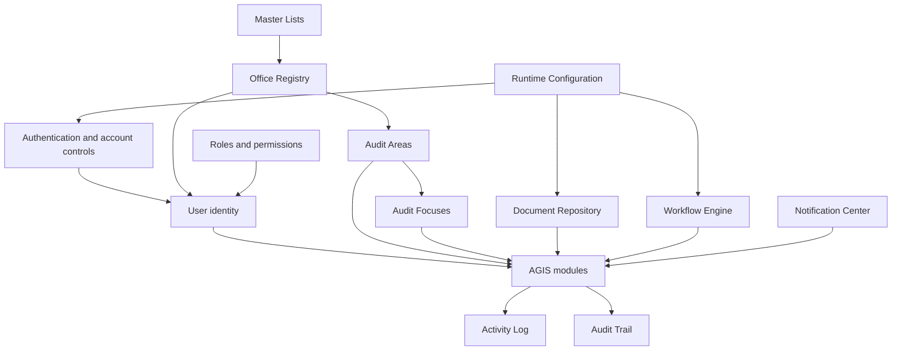
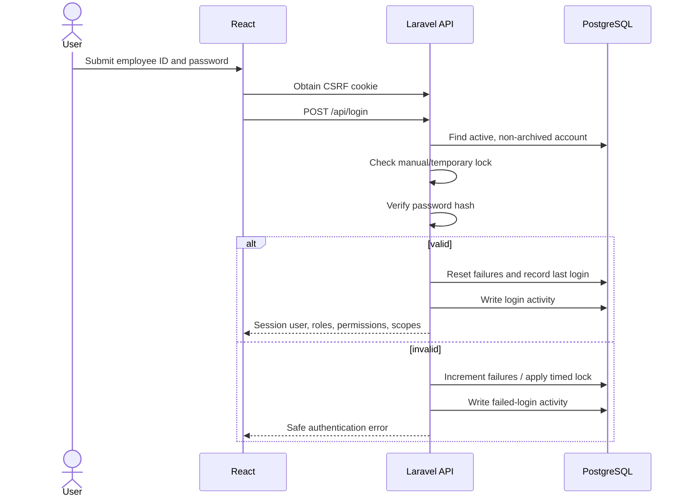
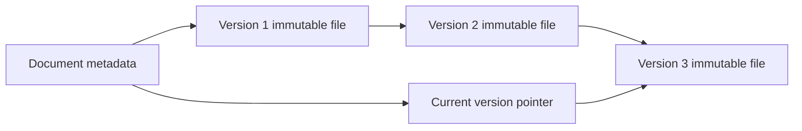
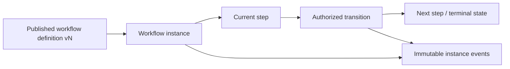

# AGIS Core Workflow Design

## 1. Purpose

AGIS Core is the platform foundation. It defines who may use AGIS, which offices
and audit classifications exist, what each user may do, and which shared services
all operational modules use.

Core currently provides:

- authentication, sessions, account lockout, and profile maintenance;
- Office, Audit Area, Audit Focus, User, Access Role, Permission, and Master List
  registries;
- immutable document versioning, confidentiality, and module links;
- a reusable workflow-definition and workflow-instance engine;
- Notification Center and delivery preferences;
- Activity Log and Audit Trail;
- runtime System Configuration;
- soft deletion, restoration, search, filtering, sorting, pagination, and
  permission-aware detail-view logging.

Core is a prerequisite for IAP, AEM, AFR, CMS, ARMIS, and AIS.

The main `/dashboard` route is a role-aware landing dashboard backed by the
protected `/api/dashboard` contract. Its module cards, status totals, overdue
recommendations, recent engagements, tasks, and quick actions are calculated
from the authenticated user's office and engagement scope. If the live
contract is unavailable, the UI retains a safe layout fallback and displays a
non-authoritative warning rather than treating fallback data as live.

<!-- Historical wording superseded:
“coming soon” messages. It must not be treated as an operational reporting
-->
The dashboard is live and scope-aware; any “coming soon” text in historical
notes must not be treated as an operational reporting result.
The protected Core Administrative Reports workspace provides scope-pinned
immutable snapshots and authenticated CSV/PDF exports with checksums;
spreadsheet formula prefixes are escaped in CSV output.



## Current implementation note

The dashboard and Administrative Reports contracts described above are the
authoritative as-built behavior. Any older static/demo dashboard wording in
historical notes is retained only for change history and must not be used as a
feature requirement.

## 2. Core roles

AGIS seeds six standard roles:

| Role | Core responsibility |
| --- | --- |
| Platform Administrator | Overall platform administration, security, configuration, and all modules |
| AGIS Administrator | Registries, roles, permissions, master lists, documents, workflows, configuration, and monitoring |
| CIAS Management | CIAS oversight, approvals, audit administration, reports, and authorized Core inquiry |
| AGIS User | Operational auditor access to assigned records and authorized shared resources |
| Auditee Representative | Office response/evidence functions, shared documents, notifications, and profile |
| Read Only User | Inquiry-only access to specifically authorized records |

A user can have multiple roles. One assignment is primary for display and legacy
compatibility. Effective permissions are the union of active assigned roles.

Access is further constrained by:

- `office_access_scope`: all offices, own office, assigned offices, or none;
- `engagement_access_scope`: all engagements, own office, assigned engagements,
  or none;
- record state and ownership;
- module-specific scope services.

## 3. Authentication and account lifecycle

### 3.1 Login identifier

Users log in with their unique employee ID. The database prevents duplicate
employee IDs. Legacy username fields may remain for compatibility but are not the
primary user-facing login identity.

### 3.2 Authentication flow



Runtime settings control session lifetime, minimum password length, failed-login
limit, and lock duration.

### 3.3 Administrative account actions

Authorized administrators can:

- create and edit a user;
- assign one office, position, employment type, and normalized name parts;
- assign multiple roles and a primary role;
- activate or disable the account;
- manually lock or unlock it;
- reset its password;
- archive or restore it.

These actions are distinct. Disabling an account is not archival, and a manual
lock is not a failed-login temporary lock.

### 3.4 Self-service profile

Users may edit their permitted personal and employment information and change
their own password. Employee ID uniqueness is enforced. Profile/password changes
record old and new values in the appropriate logs.

## 4. Office Registry

Offices are independent records. AGIS does not implement parent-office hierarchy.

An office records:

- code and name;
- office type from the `OFFICE_TYPE` master list;
- sector from the `SECTOR` master list;
- contact details;
- designated office head;
- active/archive state;
- linked users;
- linked audit areas;
- immutable change history.

The office head must be an eligible user assigned to that office. One office may
link to many Audit Areas, and an Audit Area may cover many offices.

Office actions use soft deletion. Archiving preserves user assignments, audit-area
coverage, IAP lineage, and history. Restoration reactivates the same record.

## 5. Audit Area and Audit Focus registries

### 5.1 Audit Area

An Audit Area is a reusable auditable process, system, program, function, or
theme, such as Procurement and Supply Management.

It records:

- code, name, description, and scope;
- optional parent Audit Area for area/subarea classification;
- Audit Area type;
- responsible office;
- stakeholder/covered offices;
- active/archive state;
- related Audit Focuses;
- related audit engagements and history.

Unlike offices, Audit Areas may have a parent/subarea hierarchy. Cycle prevention
ensures an area cannot become its own ancestor.

### 5.2 Audit Focus

An Audit Focus belongs to exactly one Audit Area. It narrows an area into a
specific auditable topic, for example:

```text
Procurement and Supply Management
├── Procurement Planning
├── Procurement Process Compliance
├── Supplier Selection and Contracting
├── Receiving and Inspection
├── Payment Processing
├── Inventory and Property Recording
├── Storage and Distribution
└── Monitoring and Reporting
```

A focus records code, name, description, display order, status, and archive
state. Modules select focuses only through their owning Audit Area.

## 6. User Registry

The User Registry is the authoritative account and employment screen.

Stored identity uses normalized parts:

- first name;
- optional middle initial, normally one letter plus a period;
- last name;
- optional extension.

The display name and initials are generated consistently from these parts.
Honorifics such as `Atty.` or `Engr.` are not stored as first names.

Employment information includes employee ID, office, position, government
employment type, contact number, and birth date. Position and employment type
values come from searchable master lists. An authorized administrator can add a
missing position value to its master list before assigning it.

The detail screen includes effective roles/permissions, status, office, activity
history, and last-login information.

## 7. Roles, permissions, and scopes

### 7.1 Permission format

Permissions use stable `module.action` codes, for example:

```text
core equivalent:
offices.view
offices.create
users.reset_password
documents.view_restricted
system_configuration.manage

module examples:
iap.plan approval is represented by iap.approve
cms.submit_evidence
```

Frontend checks control visibility. Backend route middleware and services enforce
the permission.

### 7.2 Role lifecycle

Authorized administrators can create, edit, clone, archive, and restore roles.
Cloning copies permissions and configurable scopes into a new role.

A role cannot be archived while active users still hold it. System roles remain
protected according to their configured restrictions.

### 7.3 Scope resolution

When a user has multiple roles:

- permissions are combined;
- the broader authorized office/engagement scope is calculated;
- inactive or archived roles do not grant access;
- the primary role does not suppress permissions from other valid assignments.

## 8. Master Lists

Master Lists supply administrator-managed dropdown values that do not define
hard-coded business state machines.

Configurable examples:

- Office Type;
- Sector;
- Position;
- Government Employment Type;
- Document Type;
- Document Confidentiality;
- Risk Level;
- IAP engagement, subject, approach, priority, and supporting-record types.

Administrators can create a category, add/edit/reorder items, and activate or
deactivate values. Used values should normally be deactivated rather than
removed.

Workflow statuses and action names are intentionally not ordinary configurable
master lists. A value that has no backend transition would produce misleading UI
without valid system behavior.

## 9. Document Repository

### 9.1 Purpose and content

Document Management stores shared reference material such as:

- PGIAM volumes;
- laws and statutes;
- COA/DBM issuances;
- local ordinances and executive issuances;
- policies and guidelines;
- books and publications;
- templates and forms.

Each document has a configurable code, type, confidentiality, title, reference
metadata, current immutable version, uploader/updater, status, and module links.

### 9.2 Immutable versioning



Uploading a replacement creates a new `DocumentVersion`; it never overwrites the
old file. Each version retains file metadata, checksum, uploader, label, change
summary, and timestamp. Duplicate content checks use SHA-256.

Archiving a document preserves every version and link.

CMS-4A supporting evidence reuses this repository. Each upload creates a
private Core `Document` and immutable `DocumentVersion`; the CMS evidence link
pins the exact version ID and SHA-256 checksum. The shared link registry can
resolve authorized draft Progress Update Versions and milestone-progress
records without exposing out-of-scope recommendations. CMS downloads apply
both recommendation scope and Core document confidentiality, using the stricter
effective classification. Removing a draft CMS evidence link never removes or
redirects the Core document or its version.

CMS-5A validator-obtained evidence uses the same boundary. Each validation
upload creates a private Core `Document` and immutable `DocumentVersion`, then
pins its exact ID, SHA-256 checksum, and effective classification to a
Validation Version or Validation Item. The shared link registry exposes only
assigned-validator draft targets. The stricter recommendation/document
classification controls download. Draft link removal retains the Core
document; submitted and historical validation links cannot be redirected or
removed.

### 9.3 Confidentiality

| Level | Default visibility |
| --- | --- |
| Public | Authenticated users with document access |
| Internal | Authenticated users with document access |
| Confidential | Users with `documents.view_confidential`, plus uploader |
| Restricted | Users with `documents.view_restricted`, plus uploader |

The backend applies the same policy to lists, metadata changes, archive/restore,
current downloads, and historical-version downloads. A user cannot assign a
classification they are not permitted to administer.

### 9.4 Module links

A document may link to Core or IAP records through typed links that preserve
module code, record type, ID, code, and label. Links do not transfer ownership or
bypass the target module's authorization.

## 10. Reusable Workflow Management

### 10.1 Definition model

A workflow definition contains:

- stable family code and version;
- module and subject type;
- draft/published/retired status;
- ordered steps;
- transitions;
- responsible/actor roles;
- required permission;
- comment requirement;
- separation-of-duties rule;
- per-step SLA.

Workflow definitions are edited only while draft. Publishing retires the previous
published version in the same family. A revision creates a new draft version.

### 10.2 Instance model



An instance pins its workflow-definition version, subject identity, office,
current step, due date, context, starter, and lock version. Later definition
revisions do not change an existing instance.

Starting an instance can explicitly select a published workflow or use the
configured Core/IAP module mapping. A step without an SLA inherits
`default_workflow_sla_hours`.

Transitions enforce current state, role, permission, office scope, required
comment, separation of duties, and optimistic locking. Definition/step/transition
history is not editable after publication.

## 11. Notification Center

Notifications record:

- recipient and optional actor;
- type, category, priority, and module;
- title and message;
- action URL/label for deep linking;
- subject identity;
- deduplication key and metadata;
- read, archive, expiry, and timestamps.

Users can read/unread, mark all read, archive/restore, filter, and maintain
preferences. Administrators with permission can send targeted notifications.

Preferences control workflow, assignment, due-date, system, in-app, and email
delivery. If SMTP and email preference are enabled, email supplements the in-app
record. Mail failure cannot undo the originating business transaction.

## 12. Activity Log and Audit Trail

### 12.1 Activity Log

Activity Log answers: **What operational action occurred?**

Examples:

- login/logout and failed login;
- record detail view;
- upload/download/export;
- assignment;
- workflow transition;
- archive/restore;
- password action.

Detail-view logging is permission-checked and deduplicated for five minutes per
user/record to prevent React rerenders from creating noise.

CMS recommendation detail reads apply `CmsRecommendationScopeService` before
writing `cms.recommendation.viewed`. The log contains the operational case ID
and generated display code, not recommendation wording, confidential source
values, file paths, or unrestricted AEMS records. An inaccessible CMS record
therefore creates no Activity Log entry.

### 12.2 Audit Trail

Audit Trail answers: **What data changed?**

It stores actor, action, record type/ID, old values, new values, IP address, user
agent, metadata, and timestamp. Significant changes use immutable audit records.

Both registries support filters and exports subject to permissions.

## 13. System Configuration

Runtime configuration groups and effects:

| Group | Examples |
| --- | --- |
| General/branding | system name, short name, organization, version, runtime logo |
| Display/regional | pagination, date format, timezone |
| Security | session timeout, password length, failed-login limit, lock duration |
| Planning | fiscal-year start, default risk, IAP capacity |
| Numbering | document, SIAP, annual plan, risk-period, prioritization formats |
| Workflow | default SLA and Core/IAP published workflow mapping |
| Documents | maximum upload size |
| Notifications | refresh interval |
| Email | enabled flag, transport, host, port, encryption, username, encrypted password, sender |

Runtime reads are cached. Saving configuration clears the cache and reapplies
Laravel runtime settings. The unauthenticated runtime endpoint exposes only safe
branding/display values; SMTP credentials and security internals are not exposed.

SMTP passwords are encrypted at rest and returned as blank to the configuration
screen. Submitting a blank secret preserves the existing encrypted value.

Logo replacement accepts a validated PNG/JPEG/WebP image, stores it under managed
public branding storage, and updates the login logo, sidebar logo, and favicon.

## 14. Soft deletion and restoration

Core never uses hard deletion for ordinary business records. Archive:

1. checks permission and record rules;
2. updates active state where applicable;
3. sets `deleted_at`;
4. records activity/audit history;
5. preserves all relationships.

Restore is a separate permission and endpoint. Referential constraints prevent
unsafe physical deletion of referenced classification records.

## 15. Core API families

All protected endpoints are under `/api` and require Sanctum:

| Capability | Endpoint family |
| --- | --- |
| Session/profile | `/login`, `/me`, `/logout`, `/profile` |
| Offices | `/offices` |
| Audit Areas | `/audit-areas` |
| Audit Focuses | `/audit-focuses` |
| Users/account controls | `/users` |
| Roles/permissions | `/roles`, `/permissions` |
| Master Lists | `/master-lists` |
| Documents/versions | `/documents` |
| Workflows/instances | `/workflows`, `/workflow-instances` |
| Notifications/preferences | `/notifications` |
| Activity and audit exports | `/activity-logs`, `/audit-logs` |
| Runtime configuration | `/runtime-configuration`, `/system-configurations` |
| View logging | `/record-views` |
| Core dashboard | `/dashboard` |
| Administrative report catalog, runs, and protected exports | `/administrative-reports`, `/administrative-report-exports/{export}/download` |

Consult `backend/routes/api.php` for exact methods and permission middleware.

## 16. Core data-integrity rules

- Employee ID is unique.
- Office code and applicable registry codes are unique among live records.
- Offices have no parent relation.
- Audit Area parent links cannot form cycles.
- Audit Focus belongs to exactly one Audit Area.
- A role with assigned users cannot be archived.
- Used records are archived, not hard-deleted.
- Document versions are immutable.
- Document confidentiality is checked on discovery and download.
- Published workflow definitions are immutable.
- Active instances pin a definition version.
- System secrets are encrypted and never returned to public runtime data.
- Multi-record actions use transactions.
- Concurrent workflow/planning changes use row locks or lock versions.

## 17. Core testing

Core feature tests cover:

- authentication, throttling, lockout, and inactive/locked users;
- seeded registry relationships;
- role permission/scope enforcement and cloning;
- user multiple roles and account controls;
- office independence, archive/restore, and history;
- Audit Area hierarchy and cycle prevention;
- document versioning, confidentiality, and authorization;
- workflows, SLAs, separation of duties, locking, and history;
- notification ownership, preferences, reminders, and deep links;
- runtime configuration, encrypted secrets, logo, and test email;
- Activity Log/Audit Trail filters and exports;
- detail-view permission and deduplication.

## 18. Extension rules

When a module consumes Core:

1. Reference Office, User, Role, Audit Area, Audit Focus, and master-list IDs
   through foreign keys.
2. Never duplicate Core identity or authorization data inside a module.
3. Enforce permissions and scope in Laravel.
4. Use Document links rather than overwriting shared repository ownership.
5. Use the workflow engine only for configurable generic workflows; keep
   module-critical state machines in code when their business invariants require
   it.
6. Generate notifications with valid deep links.
7. Record operational activities and significant old/new values.
8. Preserve soft-deleted references and immutable history.
9. Add feature tests and update documentation.
