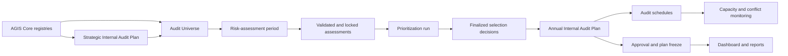
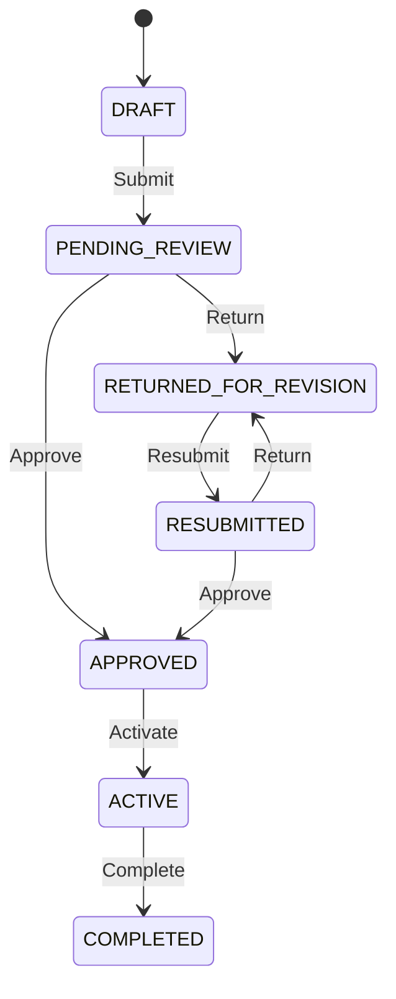
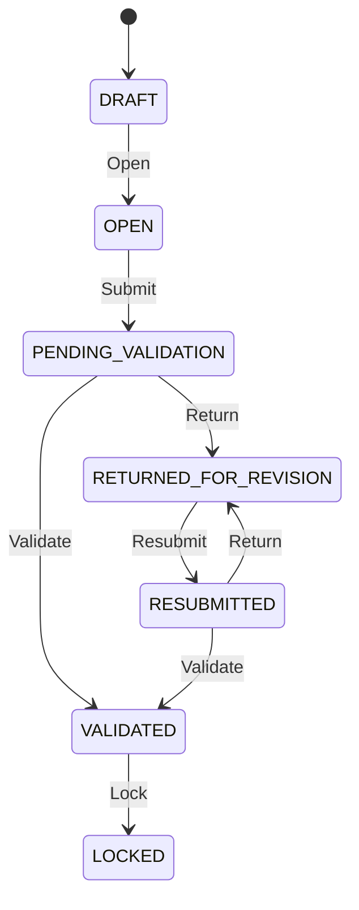
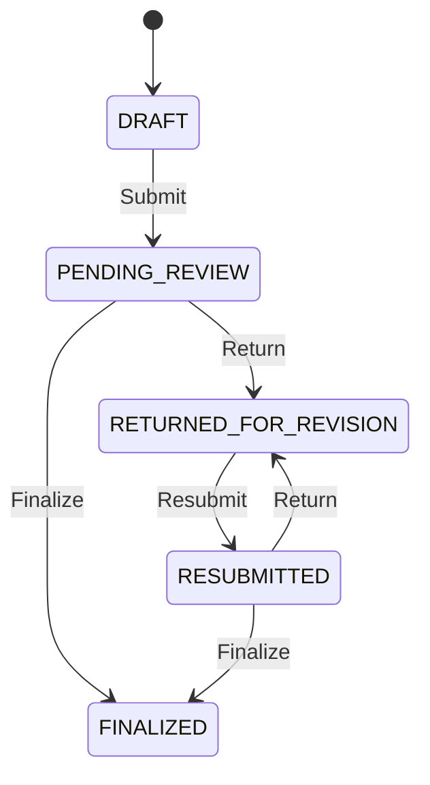
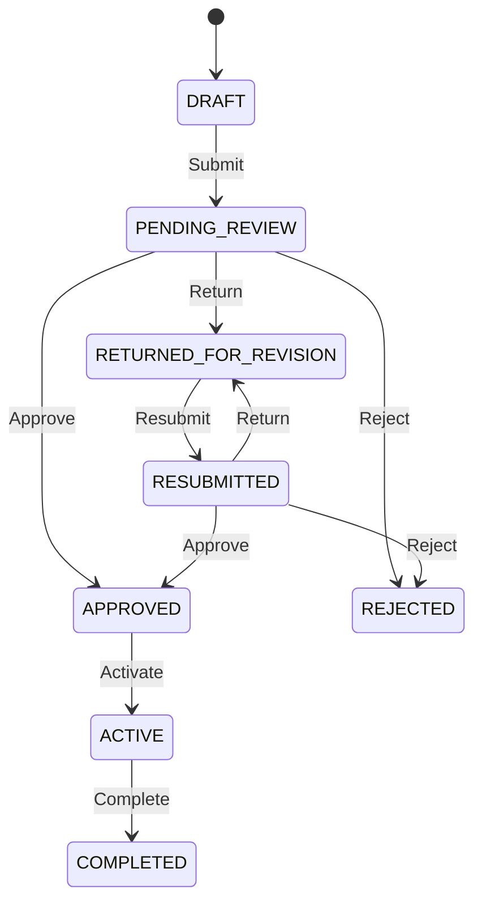

# Internal Audit Planning (IAP) Workflow Design

## 1. Document purpose

This is the as-built functional and technical specification for the AGIS Internal
Audit Planning module. It explains how strategic planning, the audit universe,
risk assessment, prioritization, annual planning, scheduling, approvals,
supporting records, dashboards, reports, security, and
history work together.

The IAP module answers two questions:

1. What should the City Internal Audit Office audit?
2. When and with what audit resources should the work be performed?

The implemented planning chain is:



BAICS is a governed planning stage between the Audit Universe and Risk
Assessment. The [BAICS Governance Contract](BAICS_GOVERNANCE_CONTRACT.md)
defines its scope, five-component assessment, Control Universe, Baseline
Assessment Report, evidence rules and approval gates. BAICS-1A/1B implements
the foundation cycle, source lineage, assignments, guarded lifecycle, version
history and IAP workspace. BAICS-2A/2B implements the five component records,
distinct assessment methods, exact Core evidence links, corroboration
exceptions, component readiness and independent review. BAICS-3A/3B adds the
traceable Control Universe, interim analysis, Baseline Assessment Report
assembly, immutable report versions and protected PDF/CSV exports. BAICS-4
adds an auditable, read-only integration ledger for approved BAR versions and
time-limited legacy exceptions consumed by risk periods, universe risk
assessments, prioritization runs, strategic plans, annual plans, and
annual-plan engagements.
BAICS-5 hardens this boundary with granular `iap.baics.integration.*`
permissions, active reviewer/authority eligibility, transition-level
separation rules, and scoped post-commit Core notifications with
recipient/version deduplication. BAICS-6 completes the conformance gate with
role/scope/SoD acceptance tests, schema migration rehearsal, shared-owner
checks, canonical navigation checks, and documentation traceability. The
committed responsive Playwright coverage remains available for manual
execution while that runner is paused.

## 2. Implementation status

The following IAP capabilities are implemented:

| Capability | Status | Primary frontend route |
| --- | --- | --- |
| IAP dashboard | Implemented with live aggregates | `/internal-audit-planning/dashboard` |
| Strategic Internal Audit Plan | Implemented | `/internal-audit-planning/strategic-plan` |
| Audit Universe Registry | Implemented | `/internal-audit-planning/audit-universe` |
| Baseline Assessment (BAICS) | BAICS-1A/1B through BAICS-6 implemented with focused verification: five-component instruments, Control Universe, interim analysis, BAR assembly, immutable versions, protected exports, approved BAR/legacy integration decisions, readiness checks, granular integration permissions, participant-scoped notifications, role/scope/SoD conformance, migration rehearsal, canonical navigation, and IAP approval gates | `/internal-audit-planning/baics`, `/internal-audit-planning/baics/control-universe`, `/internal-audit-planning/baics/integration` |
| Risk-assessment periods | Implemented | `/internal-audit-planning/risk-assessment` |
| Audit prioritization | Implemented | `/internal-audit-planning/prioritization` |
| Annual Internal Audit Plan | Implemented | `/internal-audit-planning` (detail: `/internal-audit-planning/:planId`) |
| Audit scheduling | Implemented | `/internal-audit-planning/scheduling` |
| Resource capacity and personnel | ARMIS-owned; IAP consumes read-only capacity, competency, availability, and workload projections | `/audit-resource-management/planning` |
| Supporting records and comments | Implemented in annual-plan workspace | Annual-plan detail route |
| Reports and exports | Implemented | `/internal-audit-planning/reports` |

ARMIS is the authoritative operational resource module. IAP owns planning
decisions and approved engagement-plan lineage; it consumes ARMIS capacity,
competencies, availability, workload, and person-day data read-only. The former
IAP resource tables remain historical compatibility records and are backfilled
into ARMIS by `ArmisResourceBackfillService`; they are not current write
sources. The legacy IAP resource route redirects to ARMIS Planning.

## 3. Navigation behavior

The sidebar item **Internal Audit Planning** opens the IAP dashboard. Its adjacent
toggle expands or collapses the IAP submenu. Expanding the submenu does not
change the current route.

Every route is protected by `iap.*` permissions. Hiding a submenu or action in
React is only a user-interface convenience; Laravel middleware and services make
the final authorization decision.

## 4. Roles and permissions

The IAP permission catalogue is action-specific:

| Permission | Purpose |
| --- | --- |
| `iap.view` | View authorized IAP dashboards and records |
| `iap.manage_universe` | Maintain Audit Universe subjects |
| `iap.create` | Create planning records |
| `iap.update` | Edit mutable planning records |
| `iap.assess_risk` | Score and maintain risk assessments |
| `iap.manage_engagements` | Add, import, update, defer, or archive proposed engagements |
| `iap.assign_team` | Maintain schedules, capacity, skills, and teams |
| `iap.submit` | Submit or resubmit controlled records |
| `iap.review` | Return records and add formal review comments |
| `iap.approve` | Approve, validate, or finalize records |
| `iap.activate` | Activate approved plans or lock validated periods |
| `iap.complete` | Complete active plans |
| `iap.create_revision` | Create a formal revision of an approved/active plan |
| `iap.archive` | Soft-delete eligible records |
| `iap.restore` | Restore archived records |
| `iap.export` | Generate downloadable IAP reports |

Default role behavior:

| Role | Typical IAP access |
| --- | --- |
| Platform Administrator | Full IAP access for platform administration and support |
| AGIS Administrator | View and platform-monitoring access |
| CIAS Management | Planning ownership, review, approval, resource assignment, reports |
| AGIS User | Authorized operational planning and assigned audit work |
| Auditee Representative | No IAP access by default |
| Read Only User | Approved/authorized inquiry-only planning views |

Office and assignment scopes are also evaluated. A permission does not
automatically grant access to every office or engagement.

## 5. Strategic Internal Audit Plan

### 5.1 Purpose

The Strategic Internal Audit Plan (SIAP) records the multi-year direction that
annual plans should support. A typical period is 2027–2031.

### 5.2 Record content

A strategic plan contains:

- plan code generated from `siap_plan_number_format`, unless supplied;
- start and end year;
- title, strategic context, vision, and mission alignment;
- planning methodology and expected outcomes;
- preparer and optional coordinator;
- strategic objectives;
- audit priorities/themes;
- objective-to-audit-area mappings;
- revision lineage and current-revision flag;
- workflow dates, actors, comments, and immutable events.

An objective describes an intended audit contribution. A priority/theme describes
a recurring area of emphasis. Objectives can link to one or more reusable Core
Audit Areas.

### 5.3 Workflow



Rules:

- Draft and returned records may be edited by authorized users.
- Return actions require a comment.
- The submitter cannot approve the same version.
- Completion requires an explicit confirmation.
- Approved, active, and completed versions are immutable.
- A change to an approved or active plan requires a formal revision.
- A revision copies the approved content, links it to the superseded version, and
  becomes the only current revision for that strategic period.
- Archive is a soft-delete state and is not a workflow status.

## 6. Audit Universe Registry

### 6.1 Purpose

The Audit Universe is the inventory of auditable subjects. An Office or Audit Area
is a classification or owner; it is not itself a substitute for an auditable
subject.

Examples:

- Business Tax Collection Process;
- Procurement Planning and Bidding;
- Payroll Administration;
- Disaster-response Operations;
- City Financial Management Information System.

### 6.2 Record content and relationships

Each subject includes:

- subject code and name;
- subject type from a configurable master list;
- description and audit rationale;
- responsible office;
- primary audit area;
- additional stakeholder offices;
- materiality or financial exposure;
- service impact and compliance sensitivity;
- last audit date and last audit result;
- active/archive state;
- immutable change history.

Core dependencies:

- the responsible office must be active and visible to the actor;
- the primary audit area must be linked to the responsible office;
- stakeholder offices come from the Office Registry;
- subject types come from `IAP_AUDIT_UNIVERSE_SUBJECT_TYPE`.

### 6.3 Lifecycle

Authorized users can create, edit, search, filter, sort, archive, and restore a
subject. Archive never removes risk, prioritization, or historical plan lineage.
Records already referenced by later planning stages remain historically
resolvable.

## 7. Risk assessment

### 7.1 Assessment period

Risk scoring is controlled by an assessment period rather than performed as
unstructured edits. A period defines:

- generated or supplied period code;
- assessment year and date range;
- instructions;
- weighted criteria totaling exactly 100%;
- lifecycle state and workflow actors;
- optimistic `lock_version`.

### 7.2 Assessment-period workflow



Rules:

- Only unused drafts may have their criteria structure edited.
- Criterion weights must total 100%.
- An open or returned period accepts assessment work.
- At least one assessment is required before submission.
- A return requires instructions.
- The submitter cannot validate the same period.
- Only validated/locked results can enter prioritization.
- Locked assessments are immutable.

### 7.3 Subject assessment

Each assessment belongs to one Audit Universe subject and records:

- one rating and comment for each weighted criterion;
- weighted inherent-risk score;
- control-effectiveness percentage and notes;
- calculated residual-risk score;
- inherent and residual risk levels;
- justification and assessment date;
- assessor/validator information;
- supporting evidence metadata and secured storage path;
- validation/lock state and archive state.

The default risk level is read from `default_risk_level_code`. Scoring remains
criterion-driven; the configuration supplies a safe default only where a new
record legitimately omits an explicit level.

Evidence downloads require authorization and are activity-logged. Evidence is
soft-deleted when archived.

### 7.4 Coexisting risk record systems

Two risk record systems remain active and must be treated as distinct until a
separate migration is approved:

- `iap_risk_assessments` stores the legacy annual-plan-scoped assessments used
  by the annual-plan workspace, plan-local supporting records, engagement
  references, and annual-plan revision cloning.
- `iap_universe_risk_assessments` stores assessment-period and Audit
  Universe-scoped results used by the current period workflow, prioritization,
  newer annual-plan lineage, and AEMS source snapshots.

There is no automatic one-to-one equivalence between these tables. Consumers
must follow the explicit foreign key for the workflow they are processing.
Neither table, its routes, nor its compatibility relationships should be
renamed, migrated, or removed as incidental maintenance.

## 8. Audit prioritization

### 8.1 Preconditions

A prioritization run can be created only from a risk period containing validated
or locked assessments. Only one active run may use a risk period.

### 8.2 Ranking and decisions

Creation generates a snapshot item for every eligible assessed subject. Each item
preserves:

- source period and assessment IDs;
- subject, office, and audit-area identity;
- inherent and residual scores;
- calculated priority score and system rank;
- final rank;
- decision: selected, deferred, or not selected;
- decision reason;
- manual override and override reason.

If final rank differs from system rank, an override reason is mandatory. Deferred
and not-selected decisions require an explanation.

### 8.3 Workflow



The submitter cannot finalize the same run. Finalization verifies complete
decisions, required explanations, valid ranks, and validated source assessments.
A finalized ranking is immutable and is the only valid source for annual-plan
imports.

## 9. Annual Internal Audit Plan

### 9.1 Header

The annual plan contains:

- plan code generated from `iap_plan_number_format`, unless supplied;
- fiscal year and planning date range;
- planning-period type;
- source finalized prioritization run;
- executive summary, methodology, overall objective and scope;
- limitations, management direction, and resource assumptions;
- preparer and coordinator;
- revision lineage;
- status, workflow actors/dates, lock version, and archive state.

Only one non-archived current revision may exist for a fiscal year.

### 9.2 Importing selected subjects

The annual-plan workspace imports selected prioritization items. An import:

- prevents duplicate subject selection;
- preserves the source prioritization item and risk-assessment links;
- carries responsible office and primary audit area;
- carries source scores, level, decision, and final rank;
- requires the planner to complete objectives and preliminary scope;
- assigns engagement type and audit approach;
- assigns target quarter and planned person-days.

Selected, deferred, and unplanned subjects remain visible for coverage analysis.
Removing or archiving an engagement does not erase source lineage.

### 9.3 Proposed engagement content

A proposed engagement includes:

- engagement code and title;
- engagement type, approach, planning priority, and risk level;
- background, objectives, scope, exclusions, criteria, and methodology;
- planned start/end dates and target quarter;
- estimated person-days and optional cost;
- linked offices, audit areas, and audit focuses;
- proposed team leader and members;
- required skills;
- scheduling status and history;
- prioritization and risk source snapshot.

Every selected audit area must cover every selected office in Core. Every focus
must belong to a selected area.

### 9.4 Completeness gate

Before submission, the backend checks at least:

- required plan header fields;
- valid planning dates;
- a finalized source prioritization where applicable;
- at least one active proposed engagement;
- engagement objectives and scope;
- valid office/audit-area coverage;
- planned person-days;
- assigned team/capacity requirements where required;
- no unresolved structural validation errors.

The endpoint returns a completeness result that the frontend displays. The
transition endpoint independently repeats the authoritative checks.

### 9.5 Annual-plan workflow



Rules:

- Return and rejection require comments.
- The submitter cannot approve the same plan.
- Approved versions are frozen.
- Active plans cannot be structurally edited.
- Completion requires confirmation that planned engagements are completed.
- Only approved or active plans can be formally revised.
- Revision copies the plan graph and preserves supersession links.
- Workflow actions record actor, timestamp, comment, old values, and new values.

## 10. Audit scheduling

### 10.1 Schedule content

Scheduling extends a proposed engagement with:

- planned start and end date;
- expected report date;
- proposed team leader and audit team;
- allocated person-days;
- schedule status;
- cancellation or rescheduling reason;
- immutable schedule-event history.

### 10.2 Conflict engine

Before saving and on dashboard aggregation, the service checks:

- an auditor assigned to overlapping engagements;
- overlapping audits of the same responsible office;
- an auditor unavailable because of leave, training, or another block;
- assigned person-days exceeding available capacity;
- missing required skills or specialization;
- malformed date ranges or report dates.

Warnings are returned to the UI. Business-critical conflicts can prevent a save;
informational warnings remain visible for management action.

### 10.3 Rescheduling and cancellation

Rescheduling requires a reason and creates a history event containing the old and
new schedule values. Cancellation changes status and records an event; it does
not hard-delete the engagement or its schedule history.

The page supports table and calendar views.

## 11. ARMIS resource integration

IAP preserves its historical resource ledger for lineage and reconciliation.
Current planning calculations read ARMIS. The historical ledger contains:

- annual auditor capacity;
- available person-days;
- leave, training, and unavailable date ranges;
- auditor skills;
- engagement skill requirements;
- planned allocations and calculated remaining capacity.

`iap_default_annual_person_days` is retained only for historical compatibility;
missing ARMIS capacity is surfaced as a planning conflict rather than silently
replaced by an IAP default.

ARMIS is the authoritative resource and allocation module. IAP scheduling reads
ARMIS capacity, competencies, availability, requirements, and workload through
the stable provider boundary. `ArmisResourceBackfillService` copies historical
IAP resource records idempotently into ARMIS without mutating the IAP source;
the legacy IAP resource route redirects to ARMIS Planning.

## 12. Supporting records and management comments

The annual-plan workspace supports:

- risk-assessment evidence;
- planning working papers;
- management directives;
- capacity calculations;
- approval documents;
- reviewer comments;
- return instructions;
- revision explanations.

Attachments retain file name, MIME type, size, checksum, uploader, timestamps,
visibility, and archive state. Comments retain author, type, text, parent/comment
context, and timestamps. Approved plans freeze supporting records where changing
them would alter the approved planning basis.

General reference documents belong in Core Document Management. IAP attachments
remain owned by their planning record unless explicitly linked into the shared
repository.

## 13. Dashboard

The IAP dashboard derives live, role-scoped values:

- total Audit Universe;
- critical and high-risk subjects;
- selected and deferred subjects;
- planned and unplanned audits;
- available and allocated person-days;
- capacity utilization;
- upcoming audits;
- annual-plan approval status;
- plan accomplishment;
- risk distribution charts;
- schedule-conflict warnings.

Dashboard values are calculated from the same visible records used by the detail
pages. A card must never reveal counts for records the user cannot open.

## 14. Reports and exports

Implemented reports:

1. Approved Strategic Internal Audit Plan
2. Audit Universe Report
3. Risk-assessment Matrix
4. Risk Heat Map
5. Prioritization Ranking
6. Approved Annual Internal Audit Plan
7. Annual Audit Schedule
8. Auditor Allocation Report
9. Plan Revision History

Supported output modes are PDF, Excel, CSV, and print view. Report preview and
export enforce the same role, office, approved-state, and record visibility rules
as interactive pages. Export actions are activity-logged.

## 15. Data model map

| Record group | Main tables/models | Key relationship |
| --- | --- | --- |
| SIAP | strategic plans, objectives, priorities, SIAP events | objectives map to Core Audit Areas |
| Audit Universe | universe items, stakeholder offices, history | subject belongs to responsible Office and primary Audit Area |
| Risk periods | periods, criteria, period events | period owns weighted criteria and assessments |
| Subject risk | universe risk assessments, scores, evidence | assessment belongs to period and universe subject |
| Prioritization | runs, items, events | run snapshots validated assessment results |
| Annual plan | plans, engagements, workflow events | current revision belongs to a fiscal year |
| Coverage | engagement-office/area/focus pivots | many-to-many reusable Core classifications |
| Resources | team members, capacities, unavailability, skills | allocations are per auditor and engagement |
| Scheduling | engagement schedule fields and schedule events | every change preserves old/new schedule data |
| Support | attachments and comments | records belong to an annual plan |

Foreign keys preserve lineage. Unique constraints prevent duplicate current
revisions and repeated subject imports. Soft deletes preserve recoverability.

## 16. API map

All routes below are under `/api` and require Sanctum authentication.

| Area | Main endpoint family |
| --- | --- |
| Dashboard | `GET /iap/dashboard` |
| SIAP | `/iap/strategic-plans` |
| Audit Universe | `/iap/audit-universe` |
| Risk periods and assessments | `/iap/risk-periods` |
| Prioritization | `/iap/prioritizations` |
| Annual plans | `/iap/plans` |
| Engagements and teams | `/iap/plans/{plan}/engagements` |
| Supporting records | `/iap/plans/{plan}/supporting-records`, attachments, comments |
| Scheduling | `/iap/schedules` |
| Capacity/resources | `/iap/resources` |
| Reports | `/iap/reports` |

Transitions use action endpoints rather than direct status updates:

```text
POST /api/iap/strategic-plans/{id}/transitions/{action}
POST /api/iap/risk-periods/{id}/transitions/{action}
POST /api/iap/prioritizations/{id}/transitions/{action}
POST /api/iap/plans/{id}/transitions/{action}
```

## 17. Security, concurrency, and history

- All mutation endpoints require specific permissions.
- Scope services restrict plans and supporting records by role, office, or
  assignment.
- Read-only users cannot invoke mutation endpoints.
- Workflow transitions use database transactions and row locks.
- `lock_version` detects stale concurrent updates.
- Submitter/approver separation is enforced server-side.
- Approved records are immutable.
- Archive uses soft deletion; restoration is a separate authorized action.
- Files are validated and downloaded only through protected endpoints.
- Activity Log records operational actions, exports, downloads, and detail views.
- Audit Trail preserves significant old/new values.
- Detail-view reports are deduplicated for five minutes to avoid UI-render noise.

## 18. Notifications

IAP actions can generate in-app notifications for submission, return, approval,
assignment, due dates, schedule warnings, and workflow responsibility. A
notification can deep-link to the relevant IAP route.

When outbound mail and the user's email preference are enabled, the same message
is also sent through the configured mail transport. Email failure is reported but
does not roll back the planning transaction or in-app notification.

## 19. Runtime configuration used by IAP

| Key | Runtime effect |
| --- | --- |
| `iap_plan_number_format` | Annual-plan codes |
| `siap_plan_number_format` | Strategic-plan codes |
| `risk_period_number_format` | Risk-period codes |
| `prioritization_number_format` | Prioritization-run codes |
| `default_risk_level_code` | Safe default risk level |
| `default_workflow_sla_hours` | SLA for workflow steps without an override |
| `workflow_mapping_iap` | Published default reusable workflow for IAP |
| `fiscal_year_start_month` | Current fiscal-year calculation |
| `iap_default_annual_person_days` | Legacy historical default retained for IAP lineage; current capacity is ARMIS-owned |
| `document_upload_max_mb` | IAP supporting-file limit |
| `pagination_size` | Default API and table page size |
| `timezone` and `date_format` | Display and deadline interpretation |

Workflow state lists are intentionally not editable master lists. Adding arbitrary
values to a dropdown must never create an unsupported transition.

## 20. Testing and acceptance

The IAP feature suite covers:

- Audit Universe security and recovery;
- live dashboard aggregation and scoped visibility;
- prioritization lineage and duplicate prevention;
- risk-period scoring, validation, evidence, locking, and recovery;
- schedule conflicts, cancellation, and history;
- capacity, unavailability, skills, and over-allocation;
- supporting records, comments, freezing, archive, and restore;
- annual-plan completeness, approval, separation of duties, revisions, and locks;
- SIAP content, workflow, revision, and recovery;
- all report previews and export formats;
- role and office scopes.

Run:

```powershell
cd backend
php artisan test --testsuite=Feature

cd ..
npm.cmd run lint
npm.cmd run build
```

## 21. Safe extension rules

When extending IAP:

1. Add a real state transition in backend code; do not create workflow states only
   through a master list.
2. Preserve source IDs and snapshot values when data crosses planning stages.
3. Keep approved and historical versions immutable.
4. Apply authorization and scope in the backend before returning counts or rows.
5. Use a transaction and lock for multi-record decisions.
6. Add Activity Log and Audit Trail events.
7. Add feature tests for success, forbidden access, conflicts, and recovery.
8. Update this document and the API/data documentation.
