# AGIS System Flow

## 1. Scope

This document explains the end-to-end behavior of the implemented AGIS platform:
React browser application, Laravel API, PostgreSQL records, private/public file
storage, authorization, reusable services, notifications, Activity Log, Audit
Trail, and runtime configuration.

Detailed business specifications are in:

- [AGIS As-Built System Manual](AGIS_AS_BUILT_SYSTEM_MANUAL.md) for the consolidated module and page contract
- [AGIS Operational Playbooks](AGIS_OPERATIONAL_PLAYBOOKS.md) for step-by-step user actions and decision paths
- [AGIS Core Workflow Design](CORE_WORKFLOW_DESIGN.md)
- [IAP Workflow Design](IAP_WORKFLOW_DESIGN.md)
- [AEMS Workflow Design](AEMS_WORKFLOW_DESIGN.md)
- [AEMS Implementation Baseline](AEMS_IMPLEMENTATION_BASELINE.md)
- [CMS Workflow Design](CMS_WORKFLOW_DESIGN.md)
- [ARMIS Workflow and Implementation Checkpoint](ARMIS_WORKFLOW_DESIGN.md)
- [API and Data Reference](API_AND_DATA_REFERENCE.md)

The manual is the fastest way to answer “what do I do next?”; this document is
the request/data/control path that explains how the browser action is enforced.

## 1.1 Business-system sequence

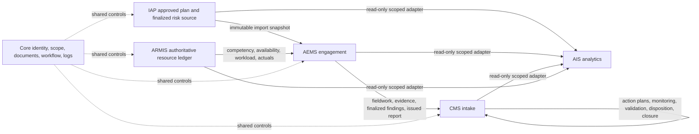

The arrows are ownership boundaries, not table-copy instructions. IAP owns its
plan, AEMS owns the audit execution and recommendation source, CMS owns the
post-transfer corrective-action case, ARMIS owns the current resource data, and
AIS owns no operational source record. Historical IAP resource values and
provider-reconciliation snapshots may remain for lineage, but they are not
read by AEMS readiness and cannot switch the live provider.

## 2. System context

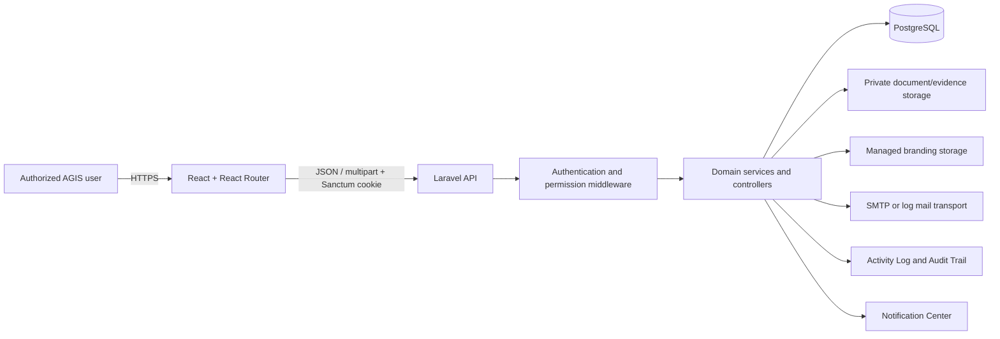

The browser never connects directly to PostgreSQL. React does not decide final
authorization. All protected reads and writes pass through Laravel.

## 3. Technology and directory map

| Layer | Technology | Main location |
| --- | --- | --- |
| Browser UI | React, React Router, Tailwind CSS, Lucide React, Recharts | `src/` |
| API client | Fetch wrapper, CSRF/Sanctum handling, typed service groups | `src/services/api.js` |
| API | Laravel controllers, requests, middleware, resources | `backend/app/Http` |
| Domain rules | Laravel services/support classes | `backend/app/Services`, `backend/app/Support` |
| Persistence | Eloquent and PostgreSQL migrations | `backend/app/Models`, `backend/database/migrations` |
| Seed/reference data | Laravel seeders | `backend/database/seeders` |
| Routes | React route tree and Laravel API routes | `src/App.jsx`, `backend/routes/api.php` |
| Tests | Laravel feature tests and frontend lint/build | `backend/tests`, npm scripts |
| Documentation | As-built guides and standards | `docs/` |

## 4. Application startup flow

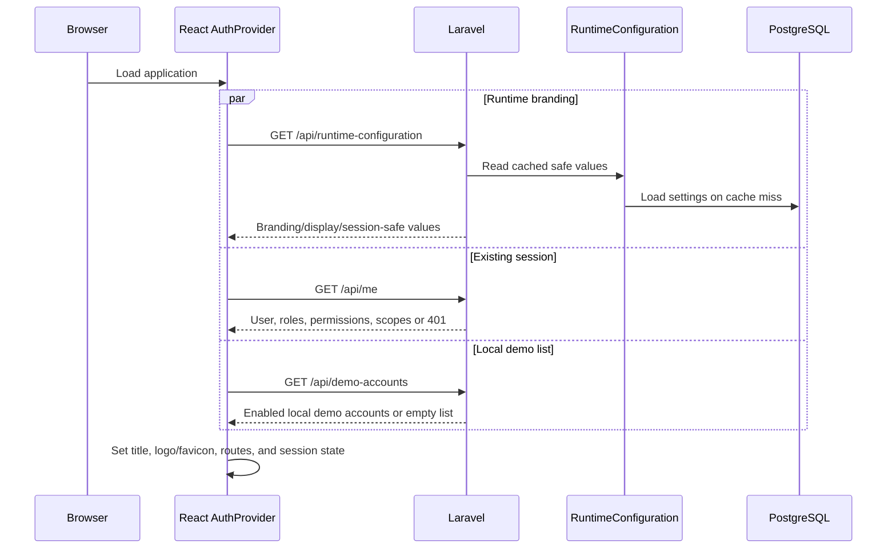

Safe defaults keep the login screen usable if runtime configuration is not yet
available. Public runtime data does not include SMTP credentials, password
secrets, or internal security values.

## 5. Request lifecycle

Every authenticated API request follows this general path:

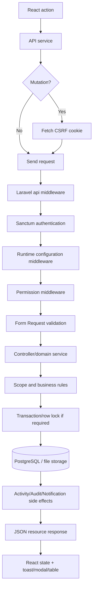

### 5.1 Response behavior

Typical status handling:

| Status | Meaning | Frontend behavior |
| --- | --- | --- |
| `200` | Successful read/update/action | Replace state and show success where applicable |
| `201` | Record created | Add/refresh record and show success |
| `401` | No valid session | Return to login/session-expired flow |
| `403` | Authenticated but not authorized | Show safe permission message |
| `404` | Record/file unavailable or outside safe resolution | Show not-found message |
| `409` or `422` | Conflict, stale state, or validation rule | Display actionable validation/conflict feedback |
| `500` | Unexpected server failure | Show safe generic error; server retains diagnostic details |

## 6. Authentication and authorization flow

Authentication establishes identity. Authorization evaluates:

1. active, non-archived, unlocked account;
2. route permission;
3. effective permissions from all active roles;
4. office scope;
5. engagement or assignment scope;
6. record status/ownership;
7. action-specific business rules.

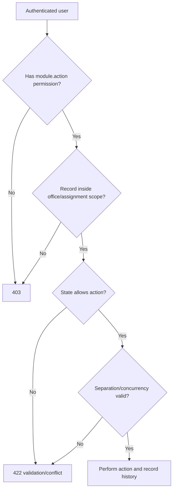

Frontend permission checks must mirror, but never replace, these backend checks.

## 7. Registry list and detail flow

Implemented registry pages use a common interaction:

1. Load the permission-scoped collection and dropdown/reference data.
2. Render summary cards, a large search field, filters, sortable columns, and
   pagination.
3. Click a row to open details.
4. Report the detail view to `POST /api/record-views`.
5. The server validates the associated view permission.
6. The server writes one Activity Log entry per user/record within five minutes.
7. Edit/archive/restore actions use explicit controls and confirmation dialogs.

The five-minute view window avoids false activity created by React rerenders.

## 8. Create and update flow

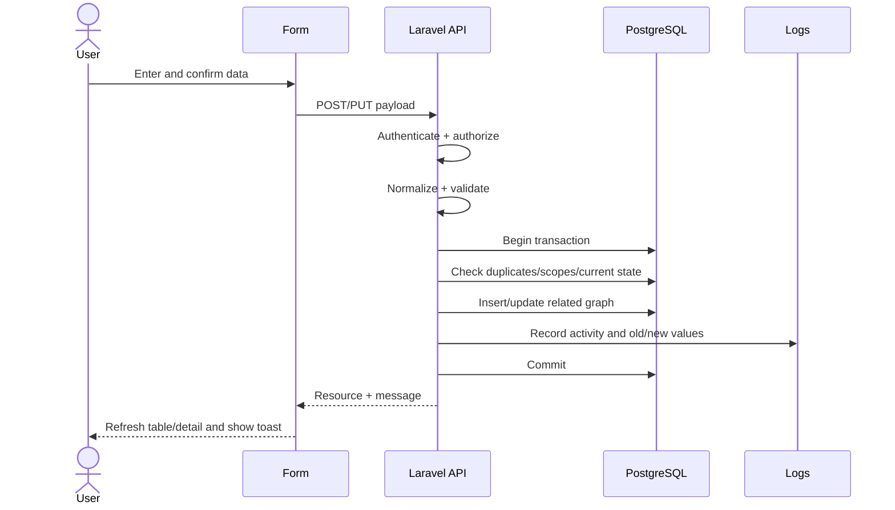

Database unique constraints remain the final duplicate guard even when the form
performs early checks.

## 9. Archive and restore flow

AGIS uses recoverable archive:

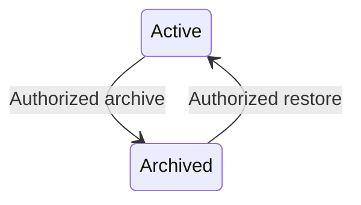

Archive normally sets an inactive state and `deleted_at`, then records history.
It does not delete relationships, files, versions, workflow events, or audit
lineage. Restore resolves the same record ID and reactivates it after validation.

## 10. Controlled approval flow

Module-critical approvals use code-defined transitions:

1. User chooses an allowed action.
2. Frontend sends action, lock version, required comment, and any confirmation.
3. Backend locks the current row.
4. Backend confirms the current status still allows the action.
5. Backend checks permission, scope, completeness, and separation of duties.
6. Backend updates status, actor/date fields, and lock version.
7. Backend creates an immutable event with old/new values.
8. Backend creates Activity/Audit records.
9. Backend delivers an in-app notification and optional email.
10. Transaction commits and the frontend reloads the record.

Reusable generic workflows follow the same principles through workflow
definitions, steps, transitions, instances, and immutable events.

## 11. Document and file flow

### 11.1 Shared document upload

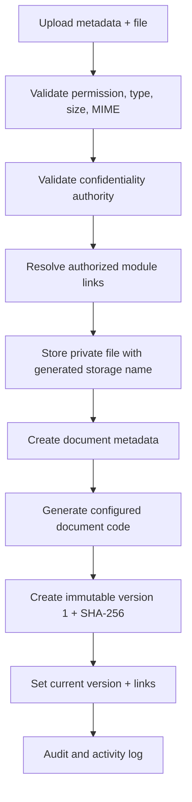

If the database transaction fails after storage, the just-uploaded file is
removed.

### 11.2 New document version

The service stores a new private file, rejects duplicate checksums, increments the
version number under a lock, updates the current-version pointer, and preserves
all earlier versions.

### 11.3 Download

The backend:

1. applies permission middleware;
2. applies confidentiality/ownership policy;
3. confirms document-version ownership;
4. confirms the private file exists;
5. records download activity;
6. streams the file with a safe original filename and MIME type.

No private storage path is exposed as a public URL.

AEMS evidence uses the same private-file boundary. Each upload creates a hidden
module-owned Core `Document` and immutable `DocumentVersion`; an evidence
replacement appends a version and never overwrites the old file. Working Paper
approval stores the exact evidence row and document-version IDs relied upon,
then locks those evidence versions against voiding or mutation.

Validated issues preserve their exact approved Working Paper versions and
verified evidence. Conversion is one-to-one and idempotent. Finding validation
locks cited evidence; communication snapshots the finding, recommendations,
recipients, confidentiality, due date, and support IDs. Finalization locks the
finding, response/rejoinder disposition, and recommendations before later CMS
transfer.

Management-response and rejoinder supporting documents use the same private
document boundary as other protected AEMS files. Every upload creates a hidden
Core `Document` and immutable `DocumentVersion`;
`aems_dialogue_attachments` pins that exact version to one response or one
rejoinder. Dialogue payloads expose the actor, creation/update dates, content,
exchange version, and checksum-bearing attachment metadata without replacing a
prior submitted exchange.

Exit Conference scheduling selects current formally communicated Findings and
internal or external participants. Completion records attendance and a
discussion outcome for every linked Finding, including agreement status,
agreement/disagreement detail, and any revised target date. It then stores a
completion snapshot and locks the schedule, outcomes, minutes, and exact
attachment `DocumentVersion` IDs. Invited Auditee Representatives acknowledge
the completed minutes through immutable, actor- and office-specific
acknowledgement records.

Draft Report generation selects current validated or later Findings, arranges
report sections, and creates a private PDF-backed `DocumentVersion`. Every
revision appends an immutable `AuditReportVersion`; return and approval comments
remain pinned to the exact reviewed version. Final Report generation accepts
only finalized Findings and records confidentiality, approving authority, and
version-bound recipients. Issuance records the date and actor, marks recipients
sent, locks the exact PDF and checksum, and idempotently creates one CMS intake
record for each included finalized recommendation. The intake service
independently revalidates the issued report, exact locked version, included
current finalized Finding, non-archived Recommendation, finalized office/target
source, and existing AEMS issuance authority. Each new immutable intake
initializes one separate `CmsRecommendationCase` in `TRANSFERRED` and one
append-only `INTAKE_CREATED` event. The case is the operational root for CMS
monitoring, automation, dispositions, reopening, closure, and reporting. Each
later CMS workflow preserves the immutable intake and source snapshots.

The aggregate lifecycle is now enforced by
`AemsEngagementTransitionService`. A client sends an action and current
`lockVersion`; it cannot send a target status. Laravel policy/permission,
office and assignment scope, separation of duties, row lock, and the
authoritative child records are checked in one transaction before the parent
status changes.


The Entry Conference gate reads issued AEO, approved AEP/program, active team
roles, attendance, agenda/briefing, Notes, material-matter dispositions,
acknowledgements, and any exact Core DocumentVersion attachments. Completion or
an independently authorized waiver is required before fieldwork.

### 11.4 AEMS Engagement Tracker derivation

The Engagement Tracker loads only `AuditEngagement` records visible through the
central role-and-assignment scope. It then reads the current AEO, AEP, Audit
Program, Entry Conference, and procedures, Working Papers, Evidence revisions, Findings,
Management Responses, Exit Conferences, Audit Report, recipients, and
recommendations.

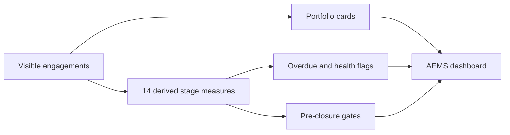

No tracker-owned workflow state is written. Filters and pagination affect the
engagement list; the cards remain totals for the complete visible portfolio.
Pre-closure readiness covers the Entry Conference, enforceable child-work,
issuance, recipient, CMS-transfer, person-day, and review gates. It is advisory.
The formal Completion Assessment, Completion & Transfer, and Closure workflows
separately evaluate delivery, reconcile the issued report and ARMIS/IAP effort,
generate an authoritative checklist, preserve an exact final document index,
approve retention/custody metadata, record lessons, and authorize the final
`CLOSED` transition. CMS transfer retries are idempotent; approved transfer and
effort snapshots are immutable. The backend locks and re-evaluates the complete
aggregate in one transaction; a 100% tracker value cannot close an engagement.

The AEMS-1B React shell presents the engagement registry and SCR-220 workspace
through grouped sidebar navigation. Engagement tabs deep-link to the existing
team, AEO, AEP, Audit Program, Working Paper, Issues, Findings, Response,
Conference, and Report workspaces while retaining the engagement identifier.
The shell displays the AEMS-1A phase, administrative status, canonical office,
and legacy multi-office warning; it does not authorize transitions or replace
backend scope checks.

The final document index references exact existing private
`DocumentVersion`s—it does not duplicate files. A replaceable
`EngagementRetentionProvider` supplies interim AEMS custody/retention metadata
until Core Records Management replaces that boundary. Exceptional reopening
requires written authority and independent CIAS approval and preserves the
original closed snapshots as history.

### 11.5 AEMS cross-module integration flow

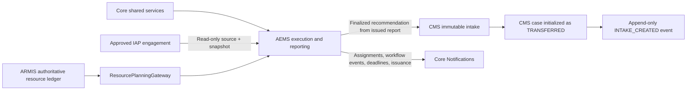

The IAP adapter owns eligibility and locking; AEMS owns the resulting lineage
relationship and immutable source snapshot. The adapter never writes an
approved IAP source row (the legacy IAP link is a computed compatibility
projection). The CMS adapter delegates to
`CmsIntakeService`, which owns source eligibility, the unique transfer key,
conflict-safe create-once intake, case initialization, intake event, and AEMS
lineage synchronization. Unique database keys plus insert-ignore/re-query
semantics ensure sequential and concurrent duplicate attempts resolve to the
same source-matching intake. A conflicting immutable identity is rejected.
Formally excluded AEMS recommendations create no CMS intake, case, or event.
The resource contract reads ARMIS capacity, unavailability, skills,
requirements, and person-day ledgers directly. IAP resource records are
historical lineage only and are never an active fallback. ARMIS-1A provides a
scope-aware resource registry and normalized capacity/workload/actuals
foundation, and ARMIS-2A adds the controlled competency/certification backend
with exact Core Document Version evidence, independent verification, and
immutable corrections. ARMIS-3A now adds a separate, scope-aware planning
ledger for availability periods, annual capacity, planned workload, and
utilization; it is independently reviewed, optimistically locked, and
audited. ARMIS-4A now adds a separate assignment and actual-person-day ledger
with conflict, capacity, competency, and immutable revision rules. ARMIS-5A
adds immutable scope-pinned operational reports, protected CSV/PDF exports,
administration status, notification counts, and private checksumed downloads.
ARMIS-5B adds the protected reports and administration React workspace, with
backend-generated snapshots, permission-aware export controls, authenticated
downloads, run history, provider status, workflow contracts, and responsive
scope/hardening presentation. It remains read-only for administration and does
not switch provider authority.
ARMIS-6A adds the read-only `ArmisResourcePlanningGateway` and the
`ConfigurableResourcePlanningGateway` boundary. `ARMIS_AUTHORITATIVE` is the
only operational mode: AEMS reads current ARMIS records directly and blocks
missing resource, competency, capacity, availability, independence, or
person-day data. Historical shadow/fallback comparison records are not an
assignment-readiness gate and cannot switch ownership. AIS integration remains
a later gate.

AEMS-11 exposes the protected `/api/aems/integrations/status` contract for
operational and security review. It reports Core provider ownership, read-only
IAP lineage, ARMIS sole-provider state, CMS immutable-intake provenance,
and referential-health checks without exposing global counts to scoped users.
No AIS provider or route is included.

Core services remain shared rather than copied into AEMS. Roles and scopes
authorize access; Master Lists supply descriptive values; Core
`DocumentVersion`s preserve files and checksums; runtime configuration supplies
limits, timezone, pagination, and document numbering; Activity Log and Audit
Trail record mutations; Notifications are queued after successful AEMS
transactions; and the daily reminder schedule detects overdue procedures,
Management Response deadlines, and upcoming Exit Conferences. AEMS keeps
domain-specific transition guards even though the
generic Core workflow engine remains available, preventing configurable steps
from introducing unsupported audit states.

### 11.6 CMS-2A/2B registry and assignment flow

An issued AEMS recommendation creates the immutable CMS intake and its
`TRANSFERRED` operational case; users cannot manually create cases. CMS-2A
reads that case through one database-level visibility scope combining active
account, granular permission (or temporary `cms.view` inquiry compatibility),
role authority, responsible office, active Compliance Monitor assignment,
confidentiality snapshot, and record state.

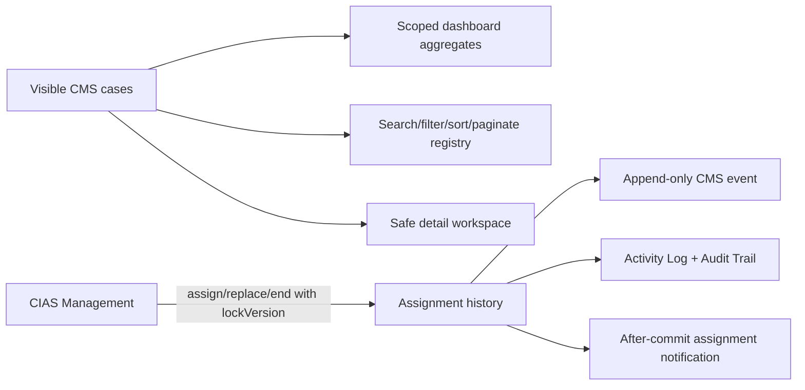

Out-of-scope records resolve as unavailable and do not contribute to totals,
filter options, grouped dashboard counts, or detail-view logs. `OVERDUE` is
derived from the effective target date and evaluation date; it is not stored as
a workflow status. Assignment changes increment the case lock but do not change
its workflow state or grant validation or closure authority.

CMS-2B exposes the scoped backend through dedicated authenticated React routes:

- `/compliance-management` redirects to the CMS dashboard;
- `/compliance-management/dashboard` renders live cards, grouped summaries,
  attention links, recent transfers, aging records, scope, and evaluation time;
- `/compliance-management/recommendations` uses server-side search, filter,
  sort, and pagination with URL-backed filter state;
- `/compliance-management/recommendations/{caseId}` renders the safe overview,
  immutable AEMS lineage, assignments, and event history.

The React shell uses granular permissions for visibility only. Laravel remains
authoritative for record scope and returns inaccessible cases as unavailable.
Monitor assignment, replacement, and ending submit the current `lockVersion`;
stale-state responses explain the conflict and reload the current case. The
due-soon dashboard metric remains visibly unavailable because no approved
runtime threshold exists.

### 11.7 CMS-3A/3B Corrective Action Plan flow

The responsible office creates one Action Plan family for an authorized
recommendation. The initial draft moves the case from `TRANSFERRED` to
`FOR_ACTION_PLAN`. Draft content and milestones remain management-owned.

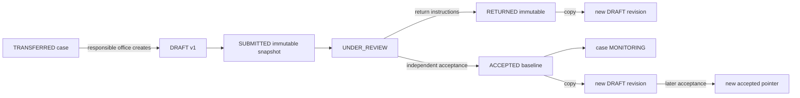

`CmsRecommendationScopeService` remains authoritative. Responsible-office
mutations require matching office and granular permission. Review, return, and
acceptance require an active Compliance Monitor or CIAS Management reviewer who
is independent of the owner office, preparer, focal user, and submitter.

Transactions, row locks, optimistic version locks, unique family/version/active
constraints, immutable snapshots, append-only recommendation events, Activity
Log, Audit Trail, and after-commit notifications preserve the official accepted
baseline.

CMS-3B exposes the aggregate at
`/compliance-management/recommendations/{caseId}/action-plan`, linked from the
authorized recommendation detail workspace. Responsible-office users prepare
the draft and ordered milestones; independent reviewers start review, return
with instructions, or accept. Historical versions are read-only, and the
accepted baseline remains distinct from a later current revision. The client
uses backend `availableActions`, granular presentation permissions, and the
latest `lockVersion`, while Laravel remains authoritative for scope, workflow,
separation of duties, and stale-state rejection.

### 11.8 CMS-4A management Progress Update flow

An authorized responsible office reports progress only against the current
accepted Action Plan baseline:

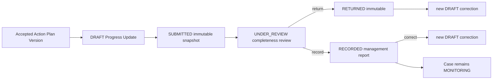

Each reporting-period family pins the exact accepted plan version. Milestone
reports preserve accepted milestone snapshots. Weighted management-reported
progress is calculated server-side with half-up, two-decimal rounding;
unweighted plans retain management's explicit overall percentage.

Supporting files use private Core `Document` and immutable `DocumentVersion`
records. CMS links the exact version and checksum, applies the stricter
recommendation/document confidentiality, and never follows a later document
version. Draft evidence links may be removed without deleting the file;
submitted links are immutable. Scope-safe resolution protects records and
downloads.

`RECORDED` means completeness-reviewed management information, not independent
validation. Reported 100% does not change the case, establish implementation,
or start closure. CMS-4B presents this boundary; CMS-5A performs the separate
professional validation below.

### 11.9 CMS-5A independent Validation Review flow

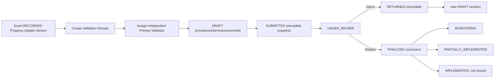

Review creation pins the accepted Action Plan Version, latest eligible current
recorded Progress Update Version, milestone progress, and exact management
evidence. It atomically assigns one eligible validator and changes
`MONITORING`/`PARTIALLY_IMPLEMENTED` to `FOR_VALIDATION`. The validator cannot
belong to the responsible office, prepare/submit the source management records,
record the Progress Update, or be the current Compliance Monitor.

Milestone Validation Items, management Evidence Assessments, and
validator-obtained private Core `DocumentVersion`s remain draft-editable until
submission. Submission snapshots all source and professional records. A
separate eligible CIAS supervisor starts review, returns immutable work for a
new revision, or finalizes one of four conclusions. Finalization atomically
updates the version/review pointers and case state, event, Activity Log, Audit
Trail, and after-commit notifications. `IMPLEMENTED` never means `CLOSED`.

Recommendation detail and dashboard payloads add backward-compatible,
visibility-scoped validation summaries. CMS-5B adds the protected React
validation workspace described below. Later CMS-6 through CMS-10 increments add
extensions, escalation, closure, dispositions, and controlled reopening.
Automation and reports/exports are implemented. AIS-5D verified read-only analytical
views, review indicators, reports, protected exports, rate limits, private
responses, and audit events are implemented; AIS operational writes
remain reserved for later phases. ARMIS
planning, assignments, reports, monitoring, and the responsive workspaces are
available as separate operational ledgers; AEMS and IAP scheduling now read
ARMIS as the sole operational resource provider. Historical IAP resource
values remain available only for lineage and are never used for readiness.

### 11.10 Runtime logo

Branding images are the exception: validated logo files are stored in managed
public storage because the login page must display them before authentication.

## 12. Notification flow

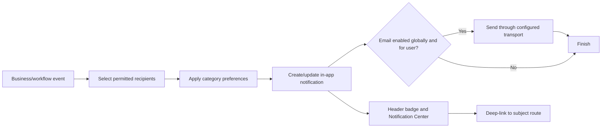

Deduplication keys prevent repeated reminder jobs from creating duplicate
notifications. Email delivery is secondary and non-transactional from the user's
perspective: the in-app record remains authoritative.

## 13. Logging flow

### 13.1 Activity Log

Operational actions create a concise human-readable event plus metadata:

- actor and optional subject user;
- action code and description;
- old/new values when useful;
- IP, user agent, module, record type/ID/code, and route;
- timestamp.

### 13.2 Audit Trail

Significant data changes create a durable delta:

- auditable model and ID;
- action;
- old values;
- new values;
- actor and request metadata.

Exports are themselves logged.

## 14. Runtime configuration flow

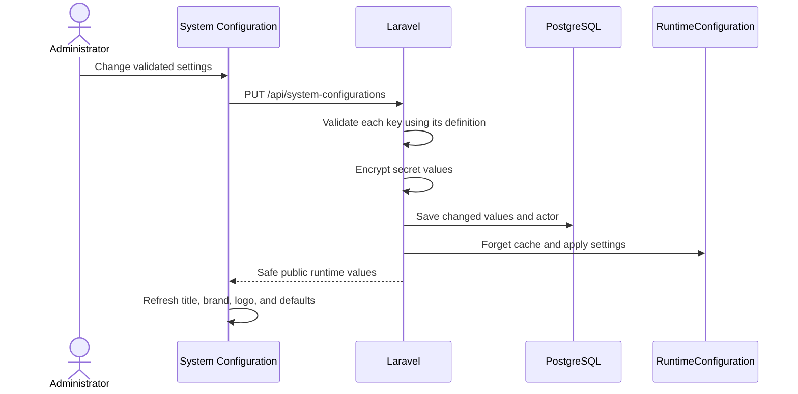

Number-format tokens:

| Token | Meaning |
| --- | --- |
| `{YEAR}` | Current/configured fiscal or record year |
| `{START_YEAR}` | Strategic planning start |
| `{END_YEAR}` | Strategic planning end |
| `{SEQ:n}` | Sequence padded to `n` digits |

Example: `DOC-{YEAR}-{SEQ:5}` becomes `DOC-2026-00042`.

## 15. IAP system flow

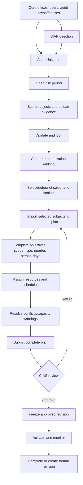

See [IAP Workflow Design](IAP_WORKFLOW_DESIGN.md) for every state and rule.

BAICS is an IAP planning stage governed by
[BAICS Governance Contract](BAICS_GOVERNANCE_CONTRACT.md). The BAICS-1A/1B
foundation now sits between Audit Universe and the risk period, providing
scoped cycles, source snapshots, assignments and guarded lifecycle/version
history. BAICS-2A/2B adds the five component assessments, distinct methods,
Core evidence links, corroboration exceptions and component readiness.
BAICS-3A/3B adds a traceable Control Universe, approved interim-analysis
sources, BAR assembly, immutable versions and protected exports. BAICS-4 adds
the approved BAR/legacy-exception integration ledger and optional enforcement
gates for IAP risk periods, prioritization, strategic plans and annual plans.
The ledger stores immutable source snapshots and never mutates the authoritative
IAP or BAICS records. Enforcement is staged behind the Core
`baics_integration_required` runtime setting (default `false`) so existing
approved IAP records can be reconciled before activation.

## 16. Search, sort, filter, and pagination flow

Large registries accept server-side parameters where implemented:

- `search`;
- domain filters such as role, status, office, area, fiscal year;
- `sortBy` and `sortDirection`;
- `page` and `perPage`;
- explicit archive inclusion.

The runtime pagination default is bounded by backend minimum/maximum rules.
Archived records are returned only when the actor has the required management
access.

## 17. Error and concurrency flow

Concurrent controlled records carry `lock_version`:

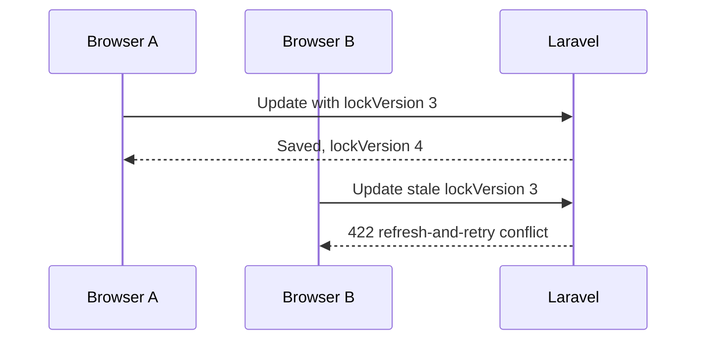

Approval transitions also use database row locks so two approvals cannot both
advance the same old state.

## 18. Seed and reset flow

The ordered seed chain creates:

1. roles and permissions;
2. configurable master lists;
3. offices;
4. audit areas and focuses;
5. system configuration;
6. Core users and optional local demo users;
7. IAP planning data;
8. workflows;
9. notifications.

The demo reset endpoint is restricted to system-configuration administrators and
is intended for local prototype/demo data. Production deployment must disable
demo accounts and protect destructive/reseed operations.

## 19. Testing and release flow

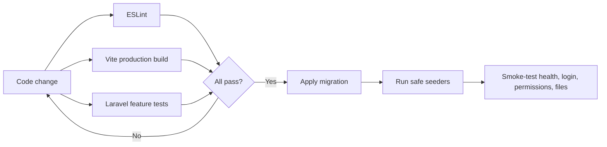

Current standard commands:

```powershell
npm.cmd run lint
npm.cmd run build

cd backend
php artisan test --testsuite=Feature
php artisan migrate --force
```

## 20. Security boundaries

- Use HTTPS outside local development.
- Keep Sanctum cookies HTTP-only and CSRF protection enabled.
- Keep `APP_DEBUG=false` in production.
- Do not place secrets in source, URLs, Activity Log, Audit Trail, or public
  runtime configuration.
- Back up PostgreSQL and both private/public managed storage.
- Enforce upload MIME/size policies and malware scanning when production
  infrastructure is available.
- Monitor lockouts, failed logins, export volume, workflow deadlines, mail
  failures, queue failures, disk usage, and database health.
- Restore tests are as important as backup creation.

## 21. Traceability checklist

Every implemented record flow should be traceable through:

1. frontend route and navigation permission;
2. API service method;
3. Laravel route permission;
4. request validation;
5. controller/domain service;
6. model/table constraints;
7. Activity/Audit event;
8. notification when applicable;
9. feature test;
10. documentation.

If one element is absent, the feature is not fully complete.

## 22. CMS progress workspace flow

```mermaid
flowchart LR
    D[Recommendation Detail] --> L[Progress Update list]
    L --> C[Create draft against accepted baseline]
    L --> V[Progress Update detail]
    V --> M[Milestone Progress]
    V --> E[Core-backed evidence]
    V --> H[Immutable version history]
    V --> W[Submit/review/return/record/revise]
    W --> R[Recorded management information]
    R --> N[CMS-5A independent validation API]
```

The React layer presents management-reported progress and completeness review;
it does not create an implementation conclusion or closure state.

## CMS independent validation workspace

CMS-5B extends the recommendation flow with a protected, recommendation-specific
Validation Review list and detail workspace. The browser uses the existing
Sanctum-aware `cmsApi` wrapper for draft updates, supervisory transitions,
assignment history, protected evidence download, and lock-conflict recovery.
The backend `availableActions` field controls mutation visibility; a 403 or
scope-safe 404 is rendered without revealing hidden reviews or documents.

Management-reported progress and evidence remain immutable source records. The
validator records procedures, professional evidence assessments, and a proposed
conclusion; an independent supervisor starts review, returns work, or finalizes
the conclusion. `IMPLEMENTED` is an independent professional conclusion only and
does not mean the recommendation is closed.

## CMS target-date extension flow

Eligible CMS cases may create one unresolved target-date extension family. The
family moves through draft, submission, independent review, assessment, and a
recorded management decision. Approval alone updates the effective target date;
the original date and case lifecycle remain unchanged. Exact document-version
evidence, optimistic locks, append-only date history, audit/activity records,
and notifications are part of the transaction. CMS-6A supplies the backend
contract and CMS-6B supplies the protected recommendation-specific React
workspace. Pending requests continue to use the current effective date for
overdue presentation; only approval changes it.

## CMS-7A escalation management flow

```mermaid
flowchart LR
    O[Eligible MONITORING/PARTIALLY_IMPLEMENTED case] --> D[Escalation notice draft]
    D --> S[Submit]
    S --> R[Independent review]
    R -->|Return| RV[Immutable notice revision]
    RV --> D
    R -->|Issue| I[Issued notice + recipient snapshots]
    I --> A[Responsible-office acknowledgement]
    I --> MR[Management response draft]
    MR --> MS[Submit response]
    MS --> RR[Independent response review]
    RR -->|Return| RRV[Immutable response revision]
    RRV --> MR
    RR -->|Accept| F[Follow-up baseline]
    F --> X[CIAS resolution]
```

CMS-7A stores escalation families, immutable notice/response versions,
recipient snapshots, append-only acknowledgements, Core Document evidence
links, and immutable escalation resolutions. Source snapshots preserve the
case status, original/effective dates, overdue context, target-date extension
context, accepted Action Plan, latest Progress Update, latest validation, and
Compliance Monitor at submission/issuance time. Escalation operational status
never mutates the recommendation implementation status; resolving an
escalation does not close the recommendation. CMS-7B provides the protected
recommendation-scoped React list/detail workspace, immutable version views,
evidence controls, acknowledgement, response, follow-up, and resolution
presentation. At the CMS-7B checkpoint, automatic creation, reminders,
reporting, and exports were later phases. CMS-8 through CMS-12B now provide
those capabilities; AIS-5D consumes CMS read-only and ARMIS is a separate
gated provider boundary.
## CMS closure boundary

CMS now distinguishes `IMPLEMENTED`, `FOR_CLOSURE`, and `CLOSED`. Management completion, accepted progress, extension approval, escalation resolution, and validation drafts do not close a recommendation. An independent finalized `IMPLEMENTED` validation supports a Closure Request; an independent review assessment and CIAS Management Closure Decision are required for formal closure.

The frontend exposes Closure only from an authorized recommendation detail context. Readiness, available actions, lock versions, scope-safe errors, and closed-case read-only behavior are supplied by CMS-8A; the client does not recalculate eligibility or provide reopening controls.

## CMS-9A disposition boundary

Accepted-risk and no-longer-applicable requests use the existing CMS visibility
service and Core document confidentiality rules. The responsible office or
compliance monitor prepares the request, an independent reviewer records the
assessment, and a different CIAS Management actor records the final decision.
Submission and decision are transactional case transitions; automation and the
browser cannot make the professional decision. Exact Core document versions,
CMS events, Activity Logs, Audit Trail entries, and after-commit notifications
are captured for every transition. CMS-9B provides the React workspace.
Reopening is implemented by CMS-10A/B; automation, reports/exports, AIS, and
ARMIS remain outside this phase.

## CMS-9B disposition workspace flow

Recommendation Detail links to the scoped Dispositions workspace when
`cms.disposition.view` is available. The client loads options and readiness,
creates only the two backend-supported disposition types, preserves draft lock
versions, and submits transitions through `availableActions`. Accepted Risk is
presented as formally accepted residual risk—not implementation or closure;
No Longer Applicable is presented as an authoritative change of circumstances.
Protected Core evidence downloads, stale-lock reload guidance, safe 403/404
states, and responsive history/evidence cards use the existing CMS UI patterns.

## CMS-10B controlled reopening workspace flow

Recommendation Detail exposes the recommendation-scoped Reopening workspace
only when `cms.reopening.view` is granted. The list and detail routes consume
the CMS-10A options, readiness, and `availableActions` responses; the client
does not recreate eligibility rules or submit arbitrary case statuses. Drafts
can be edited and linked to protected exact Core Document Versions, while
submitted, returned, reviewed, approved, and rejected versions are presented
according to their immutable backend state.

The workspace keeps the historical Closure or Disposition Decision visible and
explicitly separate from the request, independent assessment, and final
Reopening Decision. A request, review, or rejection never reactivates a case;
only an approved decision starts a new active cycle at `FOR_ACTION_PLAN` or
`MONITORING`. Stale locks offer an authoritative reload, protected downloads
remain authenticated, and scope-safe 403/404 responses do not disclose hidden
records. CMS-11A adds scheduled, idempotent reminders and reviewable
closure-readiness/escalation candidates. It does not make professional final
decisions, directly close or reopen cases, or issue escalation notices. The
CMS-11B workspace and CMS-12 reports/exports are separate completed phases;
AIS-5D is implemented as a verified hardened read-only analytical and protected reporting surface with a versioned source-integration contract, health diagnostics, immutable integration snapshots, and a responsive source-health workspace; AIS operational writes
and professional decisions remain outside scope, and
ARMIS remains outside the CMS provider boundary.

## CMS-11A automation flow

The daily scheduler loads active, versioned rules and creates one run per
rule/day. Target-date rules send deduplicated, scope-aware reminders. The
closure-readiness rule evaluates the CMS-8 gates and creates an immutable
candidate snapshot only when all blocking checks pass. The escalation rule
creates an overdue candidate draft without issuing a notice. Every run,
action, candidate, notification, event, Activity Log, and Audit Trail entry is
retained for review and replay-safe auditing.

## CMS-11B automation administration flow

Authorized users open `/compliance-management/automation` to inspect the
automation summary, versioned rules, candidate queues, and run history. A
manager edits a rule through the protected API, which creates an immutable
version. An operator may run the active rules; a reviewer acknowledges or
dismisses a candidate with a note. The React workspace keeps candidate review
separate from closure, disposition, reopening, and escalation notice
decisions. Scope and confidentiality remain backend-enforced, including on
direct refresh and mobile layouts.

## CMS-12A report and export flow

An authorized CMS report request loads visible recommendation cases through
`CmsRecommendationScopeService`, applies validated filters, orders the rows
deterministically, and persists one immutable `CmsReportRun` containing the
scope case IDs, filter set, query version, result snapshot, and SHA-256
checksum. CSV/PDF generation reads only that snapshot. CSV formula-like cells
are neutralized before writing; Dompdf renders the PDF from the same rows.

Each private artifact is stored under the local disk, recorded as an
immutable `CmsReportExport` version with MIME type, byte size, filename, and
checksum, and streamed only through the authenticated download route. The
download path rechecks current CMS scope and confidentiality before reading
the file. Generation, export, and download actions create both Activity Log
and Audit Trail records. The flow is read-only with respect to recommendation
cases and does not perform CMS transfer, closure, reopening, AIS, or ARMIS
operations.

The CMS-12B React workspace at `/compliance-management/reports` consumes the
catalog, run, export, and download contracts through `cmsApi`. It displays the
backend result snapshot and authorized scope, delegates filters and eligibility
to Laravel, and never calculates scope or creates public file URLs.

## AEMS planning-package gate

After an issued AEO, approved AEP, and approved Audit Program are available,
AEMS stores planning-specific work in its own Planning Package. IAP identifiers
and the original source snapshot are copied into immutable package-version
lineage; IAP rows are never edited by AEMS. The package combines the
preliminary survey, process flows, objectives, risk matrix, and controlled
links to program procedures, working-paper references, and exact Core document
versions. Independent review and a separate CIAS approval create the approved
baseline. The aggregate lifecycle reads that baseline and rejects
`START_FIELDWORK` until the current package version is approved and unchanged.

## AEMS execution workspace flow

The AEMS-4B Execution Workspace reads the authorized fieldwork workspace for a
selected engagement. It presents active Audit Program procedures and their
Fieldwork Records, then keeps `engagementId`, `procedureId`, and `recordId` in
the navigation context while linking to Working Papers/Evidence and Issues.
Record creation, revision, workflow transitions, traceability, procedure
completion, scope, and separation-of-duties remain backend decisions on the
AEMS-4A endpoints. The UI may capture related task assignees/due dates, surface
overdue or incomplete traceability blockers, and prepare an Issue from a
record's exact Working Paper/Evidence IDs, but it cannot finalize a record or
close an Issue on the client's authority.

## AEMS-5A Evidence Request and assessment flow

Evidence collection uses a separate Evidence Request record rather than
overloading the Audit Evidence status. An authorized audit-team user creates
the request and its immutable version, submits it, sends it to the custodian,
records partial or complete receipt, and links each received item to the exact
current `audit_evidence` row and Core `document_versions` row:

```text
DRAFT -> SUBMITTED -> SENT -> PARTIALLY_RECEIVED -> RECEIVED -> ASSESSED -> CLOSED
```

An assessor records an immutable assessment version for each received exact
document. The assessment includes the professional sufficiency,
appropriateness, relevance, reliability, competence, accuracy, completeness,
corroboration, contradiction, authenticity, integrity, confidentiality,
restriction, limitation, and evidence-gap attributes. A request cannot be
assessed until all received links have current eligible assessments.

Evidence uploaded through the AEMS service is marked as requiring assessment.
When a Finding is independently validated, the backend requires a current
assessment tied to the exact evidence `DocumentVersion`. Restricted or
access-restricted evidence is rejected unless a separately authorized,
independently performed exception approval is recorded. The assessor cannot
approve that exception, and automation cannot make either professional
decision. All actions are engagement-scope checked, optimistic-lock checked,
evented, written to Activity Log and Audit Trail, and sent through protected
Core notifications. Files remain behind authenticated Core document download
endpoints; no public URLs are exposed.

## AEMS-10 Dashboard and operational queue flow

The AEMS Dashboard reads active engagements through the authenticated
`visibleTo` scope and derives all cards, phase counts, work queues, and closure
readiness from the existing AEMS records. The client receives only protected
record references and may navigate to a queue item; it cannot calculate or
broaden the scope itself:

```text
Visible engagements
  -> phase/status aggregates
  -> overdue, review, evidence, response, conference, report, CMS, task,
     Review Note, escalation, and closure queues
  -> responsive cards, needs-attention panels, and protected exports
```

The notification panel is scoped to the signed-in actor's Core notifications.
The scheduled reminder command applies the administrator-managed AEMS runtime
windows and creates only deduplicated reminders or reviewable escalation
candidates. It never approves, finalizes, closes, transfers, or issues a
professional record. Progress and queue CSV downloads require the export
permission, recheck authorization at request time, prefix spreadsheet formula
values, and create Activity Log/Audit Trail records.
